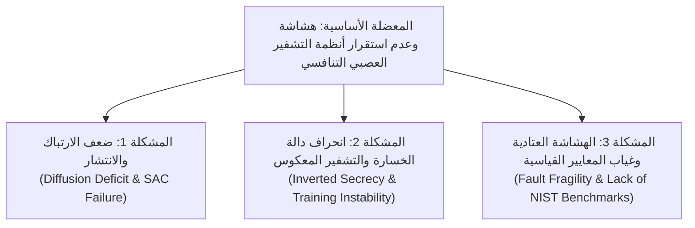
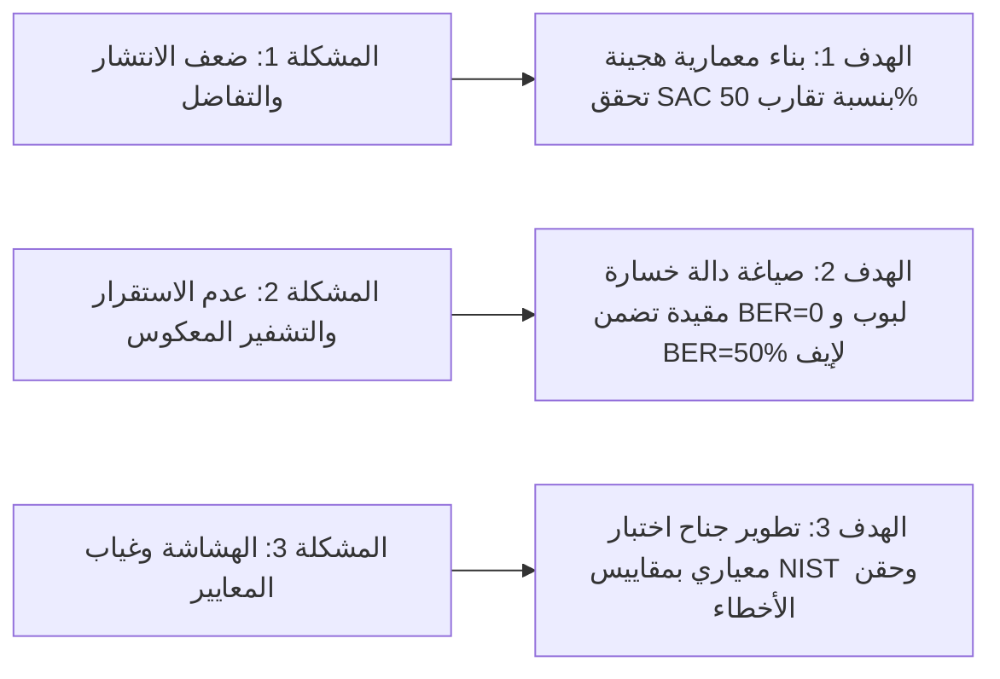
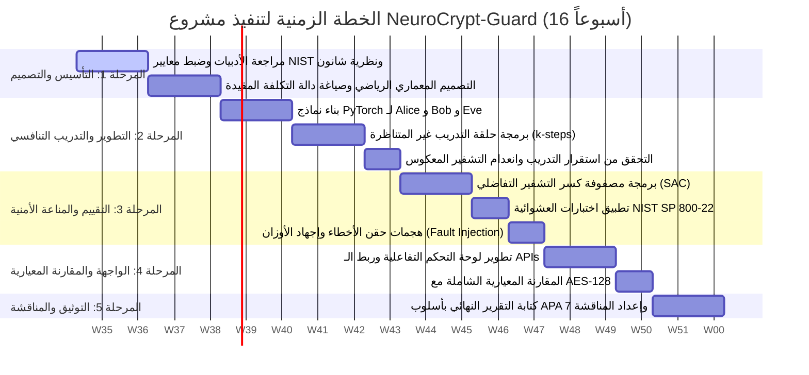

# مقترح مشروع تخرج / مشروع عملي لمادة التشفير
## المستوى الرابع - علوم الحاسوب / تقنية المعلومات والأمن السيبراني

---

```
المؤسسة الأكاديمية: كلية علوم الحاسوب وتقنية المعلومات
المقرر: التشفير العملي (Practical Cryptography) - المستوى الرابع
العام الجامعي: 2026 / 2027
المشرف الأكاديمي: [اسم الأستاذ المشرف]
```

---

## 1. عنوان المشروع (Project Title)

### العنوان الرئيسي المعتمد:
> **"NeuroCrypt-Guard: تطوير وتقييم إطار تشفير عصبي تنافسي ذاتي التكيف مقاوم للهجمات التفاضلية وحقن الأخطاء"**
> 
> *(بالإنجليزية: **NeuroCrypt-Guard: Developing and Benchmarking an Adversarial Neural Cryptosystem Resilient to Differential and Fault-Injection Attacks**)*

### مواصفات ومعايير اختيار العنوان:
* **ملفت (Catchy):** يجمع بين مصطلحي "Neuro" و "Crypt" مع اللاحقة "Guard" ليدل فوراً على نظام أمني عصبي ذكي ومتين.
* **مختصر ومباشر (Concise):** يلخص هوية النظام دون إطالة أو حشو لغوي.
* **تقني وأكاديمي (Technical):** يتضمن المصطلحات التخصصية الدقيقة (*Adversarial Neural Cryptography, Differential Attacks, Fault-Injection*).
* **يحدد المشكلة الأساسية (Problem-Specific):** يعالج مشكلة مقاومة الأنظمة العصبية للهجمات التفاضلية (Differential Cryptanalysis) وتأمينها ضد أعطال واضطرابات العتاد (Fault Injection).

---

## 2. مشكلة المشروع (Problem Statement)

### الطرح العام للمشكلة (General Context):
تعتمد أنظمة التشفير المتناظر القياسية، مثل معيار التشفير المتقدم (AES) المقرّ من قِبل المعهد الوطني للمعايير والتقنية (Daemen & Rijmen, 2002)، على تحويلات جبرية ورياضية ثابتة تضمن أماناً فائقاً وموثوقاً رياضياً. ومع ذلك، فإن هذه الخوارزميات تتسم بالجمود الهيكلي؛ إذ تعجز عن التكيف الذاتي مع القنوات الاتصالية المتغيرة أو المشوشة، أو الاندماج العضوي داخل بيئات الحوسبة العصبية التكيفية وشبكات إنترنت الأشياء (IoT) والأنظمة المستقلة ذات الموارد الحوسبية الخاصة (Abadi & Andersen, 2016).

وفي المقابل، برز نموذج **"التشفير العصبي التنافسي" (Adversarial Neural Cryptography)** الذي قدمه باحثو Google Brain كنهج ثوري تتعلم فيه الشبكات العصبية كيفية تشفير وفك تشفير الرسائل ذاتياً عبر التنافس المستمر بين طرفين شرعيين (Alice و Bob) وطرف متصنت خبيث (Eve) (Abadi & Andersen, 2016). وعلى الرغم من جاذبية الفكرة، فإن تطبيق التشفير العصبي في العالم الواقعي يصطدم بثلاث معضلات أمنية وهندسية جوهرية لم تحلها النماذج الأولية:



### المشاكل الأساسية الثلاث المتفرعة (Sub-Problems):

1. **المشكلة الأولى: عجز الانتشار والارتباك العصبـي والضعف التفاضلي (Diffusion Deficit & SAC Failure):**
   تفتقر الشبكات العصبية بطبيعتها إلى الالتزام الصارم بمعيار تأثير الانهيار الصارم (*Strict Avalanche Criterion - SAC*) الذي وضعه وبستر وتافاريس (Webster & Tavares, 1985)، والذي يقضي بأن تغيير بت واحد (1-bit) في النص الأصلي أو المفتاح يجب أن يؤدي لتغيير 50% من بتات النص المشفر. في غياب تصميم معماري متخصص، تميل الشبكات العصبية لإنتاج نصوص مشفرة تحتفظ بارتباطات خطية مع المدخلات، مما يجعلها عرضة للكسر السريع عبر أساليب تحليل التشفير التفاضلي (*Differential Cryptanalysis*) (Biham & Shamir, 1991).

2. **المشكلة الثانية: عدم استقرار التدريب التنافسي ومعضلة "التشفير المعكوس" (Training Instability & Inverted Secrecy):**
   تعاني دوال التكلفة التنافسية البسيطة (مثل طرح خطأ المتنصت $L_{Bob} - \lambda L_{Eve}$) من عدم استقرار رياضي حاد وانهيار في الأنماط (*Mode Collapse*) (Goodfellow et al., 2014). والأخطر أمنياً هو حدوث ظاهرة **"التشفير المعكوس" (Inverted Secrecy)**؛ حيث تدفع الخسارة غير المنضبطة شبكة إيف للخطأ بنسبة تقارب 100%، مما يعني نظرياً وعملياً كسر التشفير، إذ يكفي للمتنصت قلب البتات ليستعيد النص الأصلي بالكامل، بدلاً من إجباره على البقاء عند حد التخمين العشوائي الأعمى ($BER = 50\%$) المعتمد في نظرية شانون للأمان التام (Shannon, 1949).

3. **المشكلة الثالثة: الهشاشة أمام اضطرابات العتاد وغياب أدوات التقييم المعيارية (Fault Fragility & Lack of NIST Benchmarking):**
   عند نشر نماذج الاستدلال العصبية على أجهزة الحافة (Edge Devices)، تتعرض هذه الشبكات لضوضاء عتادية وأعطال عرضية، أو هجمات حقن أخطاء متعمدة (*Fault Injection Attacks*) في أوزان الشبكة (Boneh et al., 1997; ISO/IEC, 2016). ولا توجد حتى الآن أطر عمل متكاملة تقيس مناعة التشفير العصبي ضد هذه الهجمات، أو تختبر مخرجاته وفق حزم المعايير العالمية مثل حزمة الاختبارات الإحصائية الصادرة عن المعهد الوطني الأمريكي للمعايير والتقنية (NIST SP 800-22 Rev. 1a) (Rukhin et al., 2010).

---

## 3. الأهداف (Project Objectives)

انطلاقاً من المشاكل الثلاث المحددة أعلاه، يتبنى المشروع ثلاثة أهداف تقنية متسلسلة وقابلة للقياس والتحقق:



* **الهدف الأول (حل المشكلة الأولى):**
  **تصميم وبناء معمارية عصبية هجينة (Hybrid Fully-Connected & 1D-CNN Architecture)** لشبكتي أليس وبوب، تعتمد على دمج خطي كامل للمفتاح والرسالة (*Full Linear Mixing*) لتحقيق مبدأ الارتباك، يليه خط أنابيب من طبقات الالتفاف أحادية البعد المتدرجة لتحقيق الانتشار المكاني، بما يضمن الوصول بمعدل تأثير الانهيار (*Strict Avalanche Criterion - SAC*) إلى المدى القياسي **($48\% - 52\%$)** لمقاومة الهجمات التفاضلية.

* **الهدف الثاني (حل المشكلة الثانية):**
  **صياغة وتطبيق دالة تكلفة مقيدة تربيعياً ومعدلة إحصائياً (Normalized Bounded Penalty Loss Function)** تعتمد على مسافة L1 المطلقة، وتُعاقب النموذج فقط عند انحراف إيف عن خطأ التخمين العشوائي المتطابق مع نصف طول الرسالة ($N/2$). ويقترن ذلك باستراتيجية تدريب غير متناظرة متعددة الخطوات ($k$-steps training for Eve) تضمن استقرار التقارب والوصول بدقة استرجاع الطرف الشرعي (Bob) إلى **$\approx 100\%$** ($BER_{Bob} \to 0$) مع حصر المتنصت (Eve) عند التخمين الأعمى ($BER_{Eve} \approx 50\%$).

* **الهدف الثالث (حل المشكلة الثالثة):**
  **تطوير جناح برمجي مؤتمت للتقييم الأمني واختبارات الإجهاد (Automated Cryptographic Benchmark Suite)** يربط مخرجات النظام بمصفوفة الاختبارات الإحصائية الصادرة عن المعهد الوطني الأمريكي للمعايير والتقنية (**NIST SP 800-22**)، ويجري محاكاة لهجمات حقن الأخطاء العتادية والتشويش على أوزان النموذج (*Weight Perturbations & Fault Injection*)، مع توفير مقارنة أداء حوسبية وزمنية دقيقة مع خوارزمية **AES-128**.

---

## 4. الأهمية والقيمة المضافة (Project Significance & Impact)

### أين تكمن الأهمية العلمية والتطبيقية؟
1. **تجسير الفجوة بين الذكاء الاصطناعي والتشفير:** يُعد هذا المشروع استكشافاً تطبيقياً لكيفية تشفير المعلومات دون الاعتماد على خوارزميات مسبقة الصنع، مما يفتح آفاقاً لفهم الآليات الكامنة للشبكات العصبية في ابتكار بروتوكولات حماية ذاتية.
2. **سد الثغرات الأمنية للنماذج الأولية:** الانتقال بأبحاث التشفير التنافسي من مجرد "محاكاة نظرية بسيطة" إلى نظام مُختبَر بأدوات التشفير القياسية ومحصّن ضد الهجمات العكسية والتفاضلية.

### أين يُستخدم النظام؟ (مجالات التطبيق الواقعية):
* **شبكات إنترنت الأشياء ذات الموارد التكيفية (Adaptive IoT/Edge Networks):** تأمين الاتصالات الطرفية في بيئات الحساسات الذكية التي تحتاج إلى تشفير مرن يتكيف تلقائياً مع ضوضاء قنوات الإرسال المادية.
* **إخفاء البيانات العصبي (Neural Steganography):** إرسال واستقبال بيانات حساسة مشفرة تبدو من الناحية الإحصائية كتمثيلات وسائط متعددة كامنة أو ضوضاء طبيعية، مما يعيق أجهزة المراقبة والتفتيش العميق للحزم (DPI).
* **قنوات الاتصال الآمنة بين الوكلاء الذاتيين (Autonomous Multi-Agent Secure Channels):** تبادل البيانات الحساسة بين أنظمة الذكاء الاصطناعي المستقلة عبر تشفير ذاتي التوليد لا يتطلب تبادل خوارزميات قياسية مكشوفة.

### مميزات النظام المقترح مقارنة بالأنظمة التقليدية:
* **المرونة الهيكلية (Architectural Plasticity):** القدرة على تغيير مفاتيح التشفير وطول الرسائل ديناميكياً دون الحاجة لتعديل مواصفات البروتوكول البرمجي.
* **التوافق التام مع مسرعات الحوسبة العصبية (NPU/GPU Optimization):** تنفيذ عمليات التشفير المتوازية للبيانات الضخمة بسرعة استدلال عالية في البيئات المعتمدة على الذكاء الاصطناعي.
* **المتانة المقاسة معيارياً:** أول نظام يوثق أداء التشفير العصبي وفق مصفوفة قياس NIST واختبارات الانهيار وحقن الأخطاء مجتمعة.

---

## 5. التقنيات والأدوات المقترحة (Proposed Technologies & Tools)

| الفئة / الطبقة | التقنية / الأداة | الغرض والدور الوظيفي |
| :--- | :--- | :--- |
| **محرك الذكاء الاصطناعي الأساسي** | **PyTorch 2.x** | بناء معمارية الشبكات العصبية (Alice, Bob, Eve)، والتحكم الدقيق في التدرجات (Autograd)، وتجميد الأوزان أثناء الحلقات التنافسية. |
| **التسريع الحوسبي والعتادي** | **NVIDIA CUDA & cuDNN** | تسريع عمليات التدريب وحساب التدرجات، واستخدام الدقة المختلطة (AMP) لتخفيض استهلاك الذاكرة وتسريع المعالجة. |
| **جناح التقييم الأمني والرياضي** | **sts-pylib / NIST SP 800-22** | تنفيذ حزم اختبارات العشوائية الإحصائية المعتمدة دولياً (Frequency, Runs, Block Frequency, Spectral DFT). |
| **التحليل التفاضلي والإحصائي** | **NumPy & SciPy** | حساب مصفوفات الـ Strict Avalanche Criterion (SAC)، وتوليد الخرائط الحرارية لانتشار البتات واختبارات فرضيات التوزيع المنتظم. |
| **المرجعية المعيارية المقارنة** | **PyCryptodome / Cryptography** | تنفيذ تطبيق معياري لـ AES-128 لقياس أزمنة المعالجة (Throughput) وحجم التوسع المشفر وفروقات الأمان العملية. |
| **واجهة التحكم التفاعلية (Frontend/UI)** | **Streamlit أو React + TailwindCSS** | توفير لوحة تحكم رسومية حية تعرض: منحنيات التقارب، محاكي إرسال الرسائل، سلايدر حقن الأخطاء العتادية، ومصفوفة الـ SAC التفاعلية. |
| **واجهة البرمجة والخدمات (Backend)** | **FastAPI** | توفير واجهات برمجية خفيفة وسريعة (RESTful Endpoints) لخدمات التشفير وفك التشفير واستخراج تقارير الأمان بصيغة JSON. |
| **إدارة الكود والتنسيق الأكاديمي** | **Git / GitHub & LaTeX / Markdown** | ضبط الإصدارات البرمجية، وتوثيق سجل التغييرات التقنية وتنسيق التقرير العلمي النهائي. |

---

## 6. الخطة الزمنية المقترحة (Gantt Chart & Detailed Schedule)

تم توزيع المشروع على **16 أسبوعاً** دراسياً لتغطية كافة المتطلبات الهندسية والأمنية والتوثيقية:

### مخطط جانت الزمني (Gantt Chart):



### التفصيل الإجرائي للمراحل الخمس:

* **المرحلة الأولى: الأساس النظري والصياغة الرياضية (الأسابيع 1 - 4):**
  * مسح الأدبيات العلمية الموثوقة وتحديد نقاط الضعف في نماذج Google Brain السابقة.
  * الصياغة الجبرية لدالة الخسارة المقيدة وتحديد أبعاد الرسائل والمفاتيح ($N=16, 32, 64$ بت).
* **المرحلة الثانية: التطوير المعماري والتدريب التنافسي (الأسابيع 5 - 9):**
  * بناء طبقات الخلط والالتفاف (`AliceNet`, `BobNet`, `EveNet`) باستخدام مكتبة PyTorch.
  * تطبيق جدول التدريب المنفصل لضمان قوة إيف واستقرار بوب ($BER_{Bob} < 0.01$ و $BER_{Eve} \approx 0.50$).
* **المرحلة الثالثة: التقييم الأمني واختبارات الإجهاد (الأسابيع 10 - 12):**
  * إجراء $10,000$ تجربة قلب بت لقياس نسبة التغير الصارم (SAC Matrix).
  * استخراج متواليات البتات المشفرة وتشغيل فاحص اختبارات NIST الإحصائية.
  * برمجة وحدة حقن الضوضاء الغاوسية وتصفير الأوزان لقياس مدى صمود النظام عند العطل العتادي.
* **المرحلة الرابعة: التكامل البرمجي والمقارنة المعيارية (الأسابيع 13 - 14):**
  * بناء لوحة تحكم تفاعلية توضح التشفير والفك والخرائط الحرارية بصورة حية.
  * إجراء مقارنة إحصائية وزمنية للأداء مقارنة بـ AES-128.
* **المرحلة الخامسة: التوثيق الأكاديمي والتحضير للمناقشة (الأسابيع 15 - 16):**
  * إعداد مسودة التقرير النهائي وفهرسة المراجع وفق معايير APA 7th Edition.
  * إعداد العرض التقديمي (Presentation Slides) وعرض الفيديو التوضيحي للجنة المناقشة.

---

## 7. أسماء المجموعة وتوزيع المهام (Team Members & Roles)

| الرقم | اسم العضو | التخصص والمسؤولية | حزمة المهام الموكلة تفصيلياً |
| :---: | :--- | :--- | :--- |
| **1** | [اسم الطالب الأول] | **قائد الفريق & مهندس الذكاء الاصطناعي** *(AI & Architecture Lead)* | تصميم معمارية الشبكات في PyTorch، صياغة دالة الخسارة المقيدة، إدارة بيئة التدريب التنافسي وضبط الأوزان الفائقة. |
| **2** | [اسم الطالب الثاني] | **مهندس أمن التشفير** *(Cryptographic Security Lead)* | برمجة خوارزمية كسر التشفير التفاضلي ومصفوفة SAC، تطبيق حزمة اختبارات NIST الإحصائية، والمقارنة مع AES-128. |
| **3** | [اسم الطالب الثالث] | **مطور الواجهات والنظم** *(Full-Stack / Dashboard Dev)* | تطوير لوحة التحكم التفاعلية (Dashboard)، ربط نقاط النهاية في الـ Backend، وتصميم الخرائط الحرارية لتمثيل البتات. |
| **4** | [اسم الطالب الرابع] | **مهندس الجودة واختبارات الإجهاد** *(QA, Fault Injection & Research)* | محاكاة هجمات حقن الأخطاء والضوضاء، تحليل النتائج الإحصائية، صياغة ومراجعة التقرير العلمي النهائي بنمط APA 7. |

---

## 8. المراجع المعتمدة وفق نظام APA (7th Edition References)

* Abadi, M., & Andersen, D. G. (2016). *Learning to protect communications with adversarial neural cryptography*. arXiv preprint arXiv:1610.06918. https://arxiv.org/abs/1610.06918
* Biham, E., & Shamir, A. (1991). Differential cryptanalysis of DES-like cryptosystems. *Journal of Cryptology*, 4(1), 3–72. https://doi.org/10.1007/BF00630563
* Boneh, D., DeMillo, R. A., & Lipton, R. J. (1997). On the importance of checking cryptographic protocols for faults. In W. Fumy (Ed.), *Advances in Cryptology — EUROCRYPT '97* (Lecture Notes in Computer Science, Vol. 1233, pp. 37–51). Springer. https://doi.org/10.1007/3-540-69053-0_4
* Daemen, J., & Rijmen, V. (2002). *The design of Rijndael: AES - The Advanced Encryption Standard*. Springer-Verlag. https://doi.org/10.1007/978-3-662-04722-4
* Goodfellow, I., Pouget-Abadie, J., Mirza, M., Xu, B., Warde-Farley, D., Ozair, S., Courville, A., & Bengio, Y. (2014). Generative adversarial nets. In Z. Ghahramani, M. Welling, C. Cortes, N. Lawrence, & K. Q. Weinberger (Eds.), *Advances in Neural Information Processing Systems* (Vol. 27, pp. 2672–2680). Curran Associates, Inc.
* International Organization for Standardization. (2016). *Information technology — Security techniques — Testing methods for the mitigation of non-invasive attack classes on cryptographic modules* (ISO/IEC Standard No. 17825:2016). https://www.iso.org/standard/60824.html
* Klimov, A., Mityagin, A., & Shamir, A. (2002). Analysis of neural cryptography. In C. Boyd (Ed.), *Advances in Cryptology — ASIACRYPT 2002* (Lecture Notes in Computer Science, Vol. 2501, pp. 288–298). Springer. https://doi.org/10.1007/3-540-36178-2_18
* Rukhin, A., Soto, J., Nechvatal, J., Smid, M., Barker, E., Leigh, S., Levenson, M., Vangel, M., Banks, D., Heckert, A., Dray, J., & Vo, S. (2010). *A statistical test suite for random and pseudorandom number generators for cryptographic applications* (NIST Special Publication 800-22, Rev. 1a). National Institute of Standards and Technology. https://doi.org/10.6028/NIST.SP.800-22r1a
* Shannon, C. E. (1949). Communication theory of secrecy systems. *Bell System Technical Journal*, 28(4), 656–715. https://doi.org/10.1002/j.1538-7305.1949.tb00928.x
* Webster, A. F., & Tavares, S. E. (1985). On the design of S-boxes. In H. C. Williams (Ed.), *Advances in Cryptology — CRYPTO '85 Proceedings* (Lecture Notes in Computer Science, Vol. 218, pp. 523–534). Springer. https://doi.org/10.1007/3-540-39799-X_41
