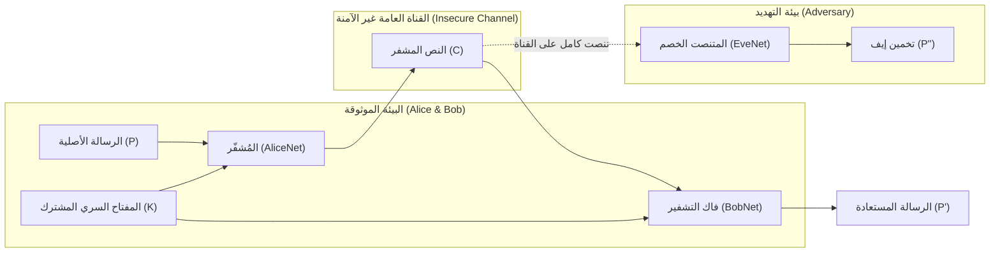
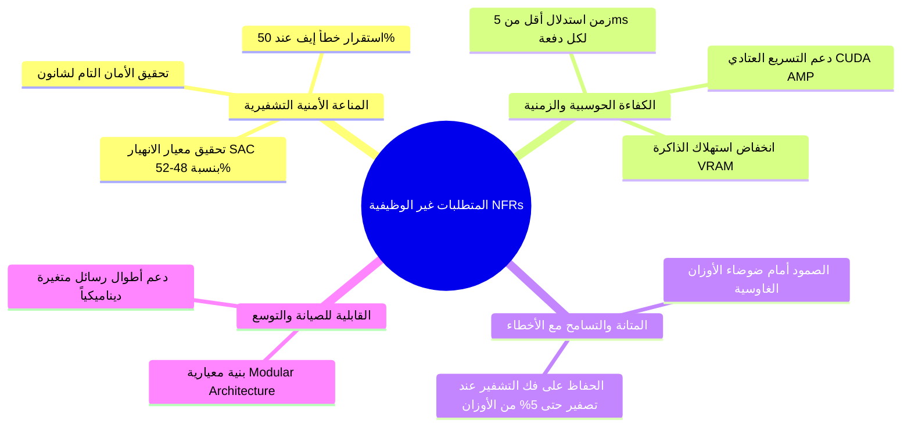
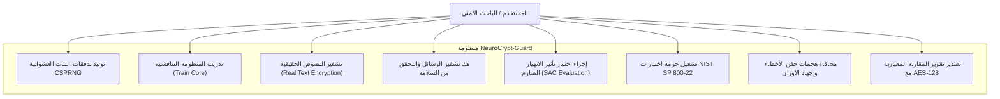
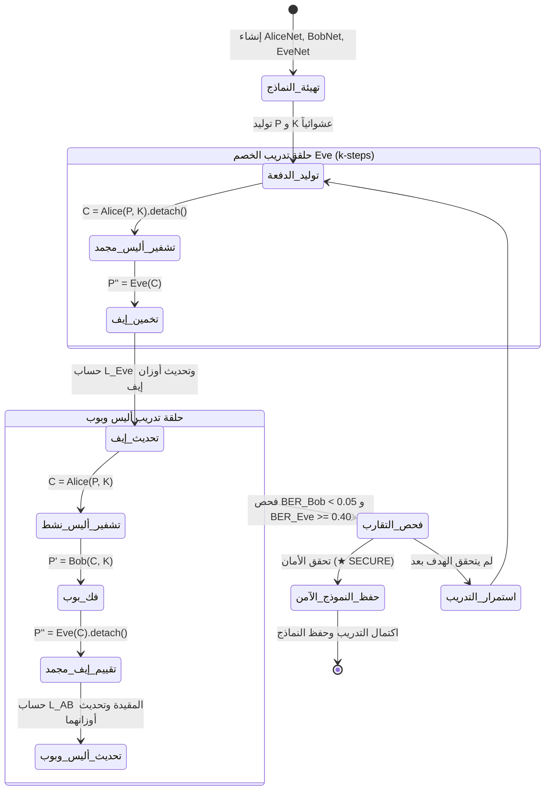

# وثيقة التحليل والمتطلبات ونموذج التهديدات الأمني

## مشروع: NeuroCrypt-Guard (Adversarial Neural Cryptography)

### توثيق هندسي وأكاديمي معتمد (System Requirements Specification - SRS)

---

## 1. مقدمة ونطاق النظام (System Overview & Scope)

### 1.1 الغرض من الوثيقة (Purpose)

تهدف هذه الوثيقة إلى تقديم تحليل هندسي وأمني شامل لمنظومة **NeuroCrypt-Guard**؛ حيث تحدد نطاق النظام، وتفصل نموذج التهديدات الأمني (Threat Model) وقدرات الخصم المتنصت (Eve)، وتصيغ المتطلبات الوظيفية (Functional Requirements) وغير الوظيفية (Non-Functional Requirements)، مع تأصيل الأساس الرياضي المستند إلى نظرية شانون للأمان التام ومعايير التشفير القياسية (Abadi & Andersen, 2016; Shannon, 1949).

### 1.2 نطاق النظام (System Scope)

نظام **NeuroCrypt-Guard** هو إطار عمل تشفير عصبي تنافسي ذاتي التكيف يقوم بتوليد وحماية الاتصالات المتناظرة بين طرفين شرعيين (Alice و Bob) عبر قناة اتصال مكشوفة يراقبها طرف خبيث ذكي (Eve). لا يعتمد النظام على أي دوال تشفير سابقة البرمجة (مثل S-Boxes في AES)، بل يتعلم التمثيل التشفيري الأمثل ذاتياً عبر خوارزميات التعلم التنافسي غير المتناظر، مع الالتزام بمعايير الفحص الأمني الصارمة (SAC و NIST SP 800-22).

---

## 2. نموذج التهديدات وتحليل الخصم (Threat Modeling & Adversary Analysis)

لتحديد مستوى الأمان المطلوب، تم بناء نموذج التهديدات استناداً إلى **مبدأ كيركهوفس (Kerckhoffs's Principle)**، الذي ينص على أن "أمان النظام لا يجب أن يعتمد على سرية الخوارزمية، بل فقط على سرية المفتاح":

### 2.1 تصنيف قدرات الخصم Eve (Attacker Capabilities):

1. **هجوم النص المشفر فقط (Ciphertext-Only Attack - COA):**
   * تمتلك إيف وصولاً غير مقيد لكافة النصوص المشفرة $C$ المنقولة عبر القناة.
   * لا تملك إيف المفتاح السري المشترك $K$.
   * تعلم إيف المعمارية الدقيقة لشبكتي Alice و Bob وأوزانهما ودوال الخسارة المستخدمة (تطبيق صارم لمبدأ كيركهوفس).
2. **سعة الخصم الحوسبية (Adversary Computational Power):**
   * وفقاً للدراسات النقدية المرجعية (Gräf & Šíma, 2017)، فإن افتراض ضعف إيف هو خطأ أمني جسيم. لذا تم تزويد إيف بسعة حوسبية متفوقة (أوزان أكثر بنسبة 50% وقنوات التفاف أعمق) مع تدريبها لخطوتين ($k=2$) لكل خطوة تدريب واحدة لأليس وبوب لضمان تمثيل **"الخصم الأمثل" (Optimal Adversary)**.
3. **هجمات التشويش وحقن الأخطاء (Fault Injection & Perturbation):**
   * يفترض النموذج إمكانية تعرض العقد الطرفية لضوضاء بيئية أو تلاعب عتادي متعمد في ذاكرة الأوزان أثناء مرحلة الاستدلال (Boneh et al., 1997; Rakin et al., 2019).

---

## 3. المتطلبات الوظيفية (Functional Requirements - FRs)

|   الرمز   | المتطلب الوظيفي                                                | الوصف التفصيلي                                                                                                                                                                                                  |
| :------------: | :--------------------------------------------------------------------------- | :--------------------------------------------------------------------------------------------------------------------------------------------------------------------------------------------------------------------------- |
| **FR-1** | **توليد المفاتيح والرسائل التشفيرية**    | يجب أن يدعم النظام توليد تدفقات بتات عشوائية منتظمة ($\{-1.0, 1.0\}^N$) باستخدام مولدات تشفيرية آمنة (CSPRNG) لأطوال $N \in \{16, 32, 64\}$.   |
| **FR-2** | **التشفير العصبي الذاتي (AliceNet)**                | يجب أن تستقبل أليس الرسالة$P$ والمفتاح $K$ وتنتج نصاً مشفراً مستمراً $C \in [-1.0, 1.0]^N$ دون الاعتماد على جداول استبدال ثابتة.    |
| **FR-3** | **فك التشفير العصبي الشرعي (BobNet)**             | يجب أن يستقبل بوب النص المشفر$C$ والمفتاح المشترك $K$ ويسترجع الرسالة $P'$ بدقة تكاد تكون تامة ($BER < 0.01$).                                  |
| **FR-4** | **محاكاة التنصت التنافسي (EveNet)**                | يجب أن تحلل شبكة إيف النص المشفر$C$ بمفرده وتنتج تخميناً $P''$ لتقليل الخطأ التراكمي.                                                                     |
| **FR-5** | **حساب دوال التكلفة المقيدة تربيعياً**   | يجب أن يطبق محرك الخسارة عقوبة تربيعية تُفعل فقط إذا هبط خطأ إيف عن حد التخمين العشوائي ($L_{Eve} < 0.5$) لمنع التشفير المعكوس.   |
| **FR-6** | **جدولة التدريب التنافسي غير المتناظر** | يجب أن تتيح حلقة التدريب ضبط معامل$k$-steps لتحديث إيف عدة مرات مقابل كل تحديث لأليس وبوب.                                                                |
| **FR-7** | **التقييم المستقل وحساب مقاييس BER**          | يجب أن يوفر النظام أداة مستقلة لحساب معدل خطأ البتات (Bit Error Rate) والفجوة الأمنية (Secrecy Gap) على بيانات اختبار مستقلة.                  |
| **FR-8** | **دعم تشفير الداتا سيت الحقيقية**             | يجب أن يدعم النظام تجزئة ومعالجة وتشفير نصوص حقيقية (مثل كتل هولمز ورسائل البريد) واختبار صمود التشفير أمام تكرار الأحرف. |

---

## 4. المتطلبات غير الوظيفية (Non-Functional Requirements - NFRs)

1. **NFR-1 (الأمان الإحصائي التام - Perfect Secrecy Compliance):**
   يجب أن يقترب التوزيع الاحتمالي للرسالة بالنظر إلى النص المشفر من التوزيع المستقل: $P(P|C) \approx P(P)$، مما يجعل تخمين إيف لا يتجاوز التخمين الأعمى ($BER_{Eve} \approx 50\%$).
2. **NFR-2 (تأثير الانهيار الصارم - Strict Avalanche Criterion):**
   عند قلب بت واحد في الرسالة أو المفتاح، يجب أن تتغير بتات النص المشفر بنسبة تقع ضمن المجال القياسي ($48\% - 52\%$) عبر $10,000$ تجربة فحص مستقلة (Webster & Tavares, 1985).
3. **NFR-3 (الأداء وسرعة الاستدلال - Real-Time Throughput):**
   يجب ألا يتجاوز زمن استدلال التشفير وفك التشفير $5$ ميلي ثانية لكل دفعة معالجة (Batch of 256) على بطاقات التسريع العصبي لضمان التوافق مع أنظمة الوقت الفعلي (Real-Time Systems).
4. **NFR-4 (المتانة أمام حقن الأخطاء - Fault Robustness):**
   يجب أن يحتفظ النظام بقدرته على فك التشفير ($BER_{Bob} < 0.05$) عند حقن ضوضاء غاوسية في أوزان الشبكة بانحراف معياري يصل إلى $\sigma = 0.02$.
5. **NFR-5 (المرونة وقابلية التوسع - Extensibility):**
   يجب تصميم الكود بأسلوب الطبقات المعيارية المنفصلة (Decoupled Components) لتسهيل تغيير أحجام النماذج ($N=16, 32, 64$) أو دمج وسائط أخرى (صور، صوت).

---

## 5. الأساس الرياضي والنظري للمنظومة (Theoretical & Mathematical Foundations)

### 5.1 نظرية شانون للأمان التام والإنتروبيا (Shannon's Perfect Secrecy)

وفقاً لكلاود شانون (Shannon, 1949)، يتحقق الأمان التام للنظام التشفيري عندما تكون الإنتروبيا المشروطة للنص الأصلي $P$ بمعلومية النص المشفر $C$ مساوية للإنتروبيا غير المشروطة للرسالة:

$$
H(P \mid C) = H(P)
$$

وهذا يعني حسابياً أن معرفة النص المشفر $C$ لا تقدم أي معلومة إحصائية على الإطلاق (Zero Mutual Information: $I(P; C) = 0$).

### 5.2 الصياغة الرياضية لدالة الخسارة التنافسية المقيدة

لمنع كارثة "التشفير المعكوس" حيث تستنتج إيف النصوص المشفرة ولكن بإشارات مقلوبة ($L_{Eve} \to 1.0$)، تم تصميم دالة الخسارة المقيدة:

$$
L_{Bob} = \frac{1}{2N} \sum_{i=1}^N |P_i - P'_i|
$$

$$
L_{Eve} = \frac{1}{2N} \sum_{i=1}^N |P_i - P''_i|
$$

$$
L_{AB} = L_{Bob} + \left( \frac{\max(0, 0.5 - L_{Eve})}{0.5} \right)^2
$$

* **حالة الأمان التام:** عندما يكون $L_{Eve} \ge 0.5$، تصبح قيمة العقوبة مساوية للصفر تماماً، وينصب تركيز أليس وبوب حصراً على تقليل $L_{Bob} \to 0$.
* **حالة الخطر الأمني:** عندما تنجح إيف في خفض خطئها ($L_{Eve} < 0.5$)، تُفرض عقوبة تربيعية هائلة على أليس تجبرها على تغيير أوزان التشفير لزيادة تعقيد النص المشفر على إيف.

---

## 6. مخططات حالات الاستخدام ومسار العمليات (UML Use Case & Activity)

### 6.1 مخطط حالات الاستخدام (Use Case Diagram):

### 6.2 مخطط مسار النشاط للتدريب التنافسي (Activity Diagram):

