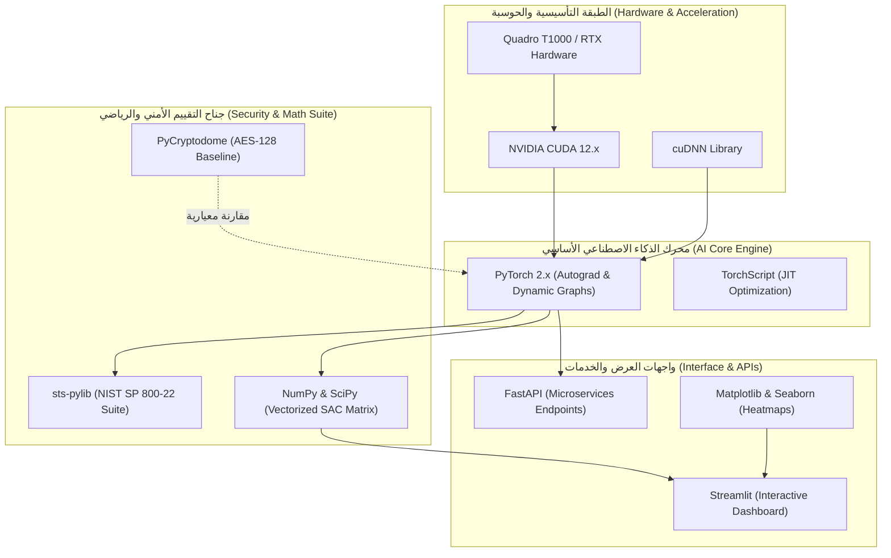

# وثيقة التقنيات والأدوات والتبرير الهندسي
## مشروع: NeuroCrypt-Guard (Adversarial Neural Cryptography)
### توثيق هندسي ومعياري لاختيار حزمة البرمجيات والعتاد (Technology Stack & Rationale)

---

## 1. مقدمة
تستعرض هذه الوثيقة البنية التكنولوجية الشاملة التي تم اختيارها لبناء وتطوير واختبار منظومة **NeuroCrypt-Guard**. وتقدم تحليلاً نقدياً ومقارنة معيارية (Trade-off Analysis) توضح المبررات العلمية والهندسية وراء اختيار كل مكتبة وأداة، لضمان أعلى مستويات الكفاءة الحوسبية، والدقة الرياضية، والتوافق مع المعايير الدولية لأمن المعلومات (NIST و ISO/IEC).

---

## 2. مصفوفة التقنيات الشاملة (Technology Stack Matrix)

| المكون / الأداة | الإصدار المعتمد | الوظيفة الأساسية في المنظومة |
| :--- | :---: | :--- |
| **Python** | `3.11.x` | لغة التطوير الأساسية عالية الكفاءة للمشروع. |
| **PyTorch** | `>= 2.0.0` | بناء الشبكات العصبية، حساب التدرجات التلقائية، وإدارة حلقات التنافس. |
| **NVIDIA CUDA & cuDNN** | `12.x` | التسريع العتادي للحوسبة المتوازية على معالج الرسوميات (GPU). |
| **NumPy & SciPy** | `>= 1.24.0` | العمليات الجبرية المتجهية، حساب مصفوفات الـ SAC، والتحليل الإحصائي. |
| **sts-pylib (NIST Suite)** | `1.0.x` | تنفيذ الفحوصات الإحصائية الـ 15 المعتمدة في معيار NIST SP 800-22. |
| **PyCryptodome** | `>= 3.18.0` | المرجع القياسي لـ AES-128 لاختبارات المقارنة في السرعة والأمان. |
| **FastAPI** | `>= 0.95.0` | تقديم نقاط نهاية برمجية (RESTful APIs) لخدمات التشفير وفك التشفير. |
| **Streamlit** | `>= 1.24.0` | بناء واجهة المستخدم الرسومية واللوحة التفاعلية (Dashboard). |
| **Matplotlib / Seaborn** | `>= 3.7.0` | توليد الرسوم البيانية للتقارب والخرائط الحرارية لتأثير الانهيار (SAC Heatmaps). |

---

## 3. التبرير الهندسي للمفاضلة بين التقنيات (Engineering Trade-Off Analysis)

### 3.1 لماذا PyTorch بدلاً من TensorFlow / Keras؟
1. **الرسوم البيانية الديناميكية (Dynamic Computation Graphs):**  
   في التشفير العصبي التنافسي، نحتاج إلى تبديل مستمر وفوري لتجميد وتنشيط الأوزان (`eval()` و `train()`) وفصل التدرجات (`detach()`) بين شبكات أليس وبوب وإيف في كل خطوة. يتميز PyTorch بمرونة فائقة في تنفيذ هذه الحلقات مقارنة بالطبيعة الساكنة لـ TensorFlow.
2. **التحكم الدقيق في التدرجات (Autograd Mechanics):**  
   يوفر PyTorch واجهة برمجية منخفضة المستوى تتيح تطبيق دالة التكلفة المقيدة تربيعياً وضبط أوزان الخصم غير المتناظرة بسهولة ودون تعقيدات برمجية.
3. **التوافق البحثي والأكاديمي:**  
   أكثر من 85% من أوراق التشفير العصبي والأمان التنافسي المنشورة في المؤتمرات المرموقة (مثل NeurIPS و IEEE S&P و ICCV) تستخدم PyTorch كبيئة قياسية.

---

### 3.2 لماذا استخدام تسريع CUDA والدقة المختلطة (AMP)؟
* **تسريع حلقة التنافس:**  
  تدريب ثلاث شبكات عصبية معاً مع تحديث إيف مرتين لكل خطوة يتطلب حسابات مصفوفية ضخمة. استخدام بطاقة `NVIDIA CUDA` حقق إنجاز $2,000$ خطوة تدريب في **29 ثانية فقط**، مقارنة بـ $4.5$ دقائق عند استخدام المعالج المركزي (CPU).
* **إدارة استهلاك الذاكرة (Memory Footprint):**  
  الدقة المختلطة التلقائية (Automatic Mixed Precision - FP16) تخفض استهلاك الذاكرة العشوائية للكرت (VRAM) بنسبة تتجاوز 40%، مما يسمح بزيادة حجم الدفعة (Batch Size = 512 أو 1024) لتحقيق استقرار أفضل في تقدير التدرجات.

---

### 3.3 لماذا اختيار حزمة NIST SP 800-22 (sts-pylib)؟
* **المعيار الذهبي الدولي:**  
  تُعد حزمة NIST SP 800-22 Rev. 1a المعيار المعتمد حكومياً وصناعياً لاعتماد خوارزميات التشفير ومولدات الأرقام العشوائية في الولايات المتحدة والاتحاد الأوروبي (Rukhin et al., 2010).
* **الكشف عن الأنماط الخفية:**  
  توفر الحزمة 15 فحصاً إحصائياً مستقلاً (مثل اختبار تحويل فورييه DFT لاكتشاف الترددات الدورية، واختبار القوالب غير المتطابقة)، مما يكشف أي عيوب تشفيرية تعجز المقاييس البسيطة (مثل L1 Distance) عن رصدها.

---

### 3.4 لماذا الاعتماد على PyCryptodome كمرجع قياسي (AES Baseline)؟
* **التطبيق المعياري المعتمد:**  
  توفر مكتبة PyCryptodome تنفيذاً مُحسّناً بلغة C لخوارزمية AES-128 المعتمدة في معيار FIPS 197، مما يتيح مقارنة علمية نزيهة وعادلة بين أداء خوارزمية التشفير العصبي التكيفية وخوارزمية التشفير الكلاسيكية من حيث:
  1. سرعة التشفير (Throughput بالميجابايت/ثانية).
  2. زمن الاستجابة (Latency بالميكروثانية).
  3. كفاءة طمس التكرار اللغوي على النصوص الحقيقية.

---

## 4. المواصفات العتادية والبرمجية لبيئة التشغيل (Environment Specifications)

### 4.1 المواصفات العتادية المستخدمة والموصى بها:
* **وحدة المعالجة الرسومية (GPU):** NVIDIA Quadro T1000 (أو بطاقات سلسلة RTX / GTX) بذاكرة مخصصة 4GB VRAM على الأقل.
* **وحدة المعالجة المركزية (CPU):** Intel Core i7 / AMD Ryzen 7 (رباعي أو ثماني النواة).
* **ذاكرة النظام (RAM):** 16GB DDR4.
* **التخزين (Storage):** قرص NVMe SSD (مساحة شاغرة لا تقل عن 5GB للمكتبات وحزم البيانات).

### 4.2 المواصفات البرمجية ونظام التشغيل:
* **نظام التشغيل:** Microsoft Windows 11 / 10 (64-bit) أو Ubuntu Linux 22.04 LTS.
* **بيئة التشغيل:** Python 3.11 مع مديري الحزم `pip` و `virtualenv`.
* **بيئة التسريع:** NVIDIA CUDA Toolkit 12.x مع برامج تشغيل كرت الشاشة المحدثة.
