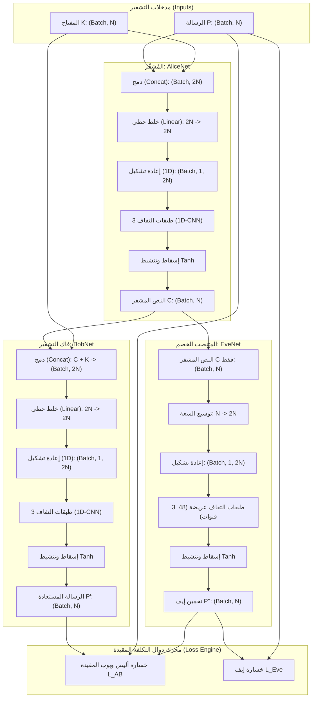
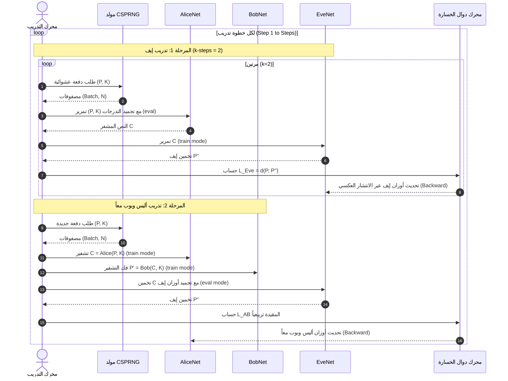

# وثيقة هيكلية ومعمارية النظام بالتفصيل

## مشروع: NeuroCrypt-Guard (Adversarial Neural Cryptography)

### توثيق هندسي ومعماري تفصيلي (System Architecture & Detailed Design Document - SDD)

---

## 1. مقدمة

تُفصل هذه الوثيقة المعمارية البرمجية والهيكلية الدقيقة لمنظومة **NeuroCrypt-Guard**. وتقدم مواصفات كل طبقة عصبية في شبكات أليس (المُشفّر)، وبوب (فاك التشفير الشرعي)، وإيف (المتنصت الخصم)، مع تحديد أبعاد المصفوفات (Tensor Dimensions)، وأحجام النواة (Kernel Sizes)، وحركة التدرجات، وخطوط تدفق البيانات (Data Pipelines) لمرحلتي التدريب والاستدلال في الوقت الفعلي.

---

## 2. المعمارية العامة للنظام (High-Level System Architecture)

تعتمد المنظومة على نموذج المعمارية الموزعة ثلاثية الأطراف في بيئة تنافسية، حيث تتفاعل المكونات عبر خطوط اتصال محددة:



---

## 3. المواصفات التفصيلية للشبكات العصبية (Layer-by-Layer Specifications)

### 3.1 معمارية شبكة أليس (`AliceNet` - المُشفّر)

* **الهدف:** دمج الرسالة والمفتاح وتحقيق مبدأي الارتباك (Confusion) والانتشار (Diffusion) لإنتاج نص مشفر $C \in [-1.0, 1.0]^N$.

| رقم الطبقة | اسم الطبقة / العملية | نوع الطبقة (PyTorch Layer)    | حجم الدخل (Input Shape) | حجم الخرج (Output Shape) | دالة التنشيط | الغرض التشفيري                                                                                         |
| :-----------------: | :----------------------------------- | :------------------------------------- | :-----------------------------: | :------------------------------: | :---------------------: | :------------------------------------------------------------------------------------------------------------------ |
|     **0**     | Input Concatenation                  | `torch.cat([P, K], dim=-1)`          |       `(B, N), (B, N)`       |           `(B, 2N)`           |            -            | دمج الرسالة مع المفتاح السري المشترك.                                                |
|     **1**     | Full Linear Mixing                   | `nn.Linear(2N, 2N)`                  |           `(B, 2N)`           |           `(B, 2N)`           |   `LeakyReLU(0.2)`   | تحقيق خلط خطي كامل بين كل بت في المفتاح وكل بت في الرسالة (Confusion). |
|     **2**     | Dimension Expansion                  | `x.unsqueeze(1)`                     |           `(B, 2N)`           |          `(B, 1, 2N)`          |            -            | تهيئة المتجه ليصبح بتنسيق القنوات لطبقات الـ 1D-CNN.                          |
|     **3**     | Spatial Conv 1                       | `nn.Conv1d(1, 32, k=4, pad='same')`  |         `(B, 1, 2N)`         |         `(B, 32, 2N)`         |   `LeakyReLU(0.2)`   | استخراج الأنماط المكانية ونشر التأثير عبر 32 قناة.                          |
|     **4**     | Spatial Conv 2                       | `nn.Conv1d(32, 32, k=2, pad='same')` |         `(B, 32, 2N)`         |         `(B, 32, 2N)`         |   `LeakyReLU(0.2)`   | تعميق انتشار البتات لمنع العلاقات الخطية.                                        |
|     **5**     | Channel Compression                  | `nn.Conv1d(32, 1, k=1, pad='same')`  |         `(B, 32, 2N)`         |          `(B, 1, 2N)`          |            -            | دمج القنوات الـ 32 في قناة واحدة مستمرة.                                              |
|     **6**     | Final Projection                     | `nn.Linear(2N, N)`                   |           `(B, 2N)`           |            `(B, N)`            |       `Tanh()`       | إسقاط المتجه لحجم النص المشفر$N$ وحصره في $[-1, 1]$.                            |

---

### 3.2 معمارية شبكة بوب (`BobNet` - فاك التشفير الشرعي)

* **الهدف:** استرجاع الرسالة الأصلية $P'$ بمعلومية النص المشفر $C$ والمفتاح السري المشترك $K$.

| رقم الطبقة | اسم الطبقة   | نوع الطبقة                    | حجم الدخل | حجم الخرج | دالة التنشيط | الغرض التشفيري                                                     |
| :-----------------: | :-------------------- | :------------------------------------- | :----------------: | :---------------: | :---------------------: | :------------------------------------------------------------------------------ |
|     **0**     | Cipher-Key Concat     | `torch.cat([C, K], dim=-1)`          | `(B, N), (B, N)` |    `(B, 2N)`    |            -            | دمج النص المشفر مع المفتاح لإلغاء التعمية.   |
|     **1**     | Decoupling Linear     | `nn.Linear(2N, 2N)`                  |    `(B, 2N)`    |    `(B, 2N)`    |   `LeakyReLU(0.2)`   | خلط النص والمفتاح لبدء عزل النص الأصلي.         |
|     **2**     | Dimension Expansion   | `x.unsqueeze(1)`                     |    `(B, 2N)`    |  `(B, 1, 2N)`  |            -            | تهيئة المتجه للالتفاف المكاني العكسي.           |
|     **3**     | Reconstruction Conv 1 | `nn.Conv1d(1, 32, k=4, pad='same')`  |   `(B, 1, 2N)`   |  `(B, 32, 2N)`  |   `LeakyReLU(0.2)`   | تصفية الضوضاء التشفيرية عبر 32 قناة استرجاع. |
|     **4**     | Reconstruction Conv 2 | `nn.Conv1d(32, 32, k=2, pad='same')` |  `(B, 32, 2N)`  |  `(B, 32, 2N)`  |   `LeakyReLU(0.2)`   | تصحيح احتمالات البتات المسترجعة.                    |
|     **5**     | Channel Compression   | `nn.Conv1d(32, 1, k=1, pad='same')`  |  `(B, 32, 2N)`  |  `(B, 1, 2N)`  |            -            | ضغط القنوات المسترجعة.                                       |
|     **6**     | Message Projection    | `nn.Linear(2N, N)`                   |    `(B, 2N)`    |    `(B, N)`    |       `Tanh()`       | إنتاج الرسالة المستعادة$P' \in [-1, 1]^N$.               |

---

### 3.3 معمارية شبكة إيف (`EveNet` - المتنصت الخصم)

* **الهدف:** استنتاج الرسالة $P''$ من النص المشفر $C$ فقط دون حيازة المفتاح.
* **ميزة التصميم:** مجهزة بسعة حوسبية أعلى (48 قناة بدلاً من 32) لتمثيل الخصم الأمثل وفق توصيات *Gräf & Šíma (2017)*.

| رقم الطبقة | اسم الطبقة | نوع الطبقة                    | حجم الدخل | حجم الخرج | دالة التنشيط | الدور في كسر التشفير                                              |
| :-----------------: | :------------------ | :------------------------------------- | :---------------: | :---------------: | :---------------------: | :--------------------------------------------------------------------------------- |
|     **1**     | Capacity Expansion  | `nn.Linear(N, 2N)`                   |    `(B, N)`    |    `(B, 2N)`    |   `LeakyReLU(0.2)`   | مضاعفة الفضاء البعدي لكشف الارتباطات الخفية. |
|     **2**     | Dimension Expansion | `x.unsqueeze(1)`                     |    `(B, 2N)`    |  `(B, 1, 2N)`  |            -            | تهيئة القناة للتحليل الالتفافي المكثف.            |
|     **3**     | Adversarial Conv 1  | `nn.Conv1d(1, 48, k=4, pad='same')`  |  `(B, 1, 2N)`  |  `(B, 48, 2N)`  |   `LeakyReLU(0.2)`   | استخراج الخصائص عبر 48 نواة التفاف.                     |
|     **4**     | Adversarial Conv 2  | `nn.Conv1d(48, 48, k=2, pad='same')` |  `(B, 48, 2N)`  |  `(B, 48, 2N)`  |   `LeakyReLU(0.2)`   | كشف أنماط التكرار والتردد في النص المشفر.        |
|     **5**     | Channel Compression | `nn.Conv1d(48, 1, k=1, pad='same')`  |  `(B, 48, 2N)`  |  `(B, 1, 2N)`  |            -            | ضغط القنوات الناتجة.                                              |
|     **6**     | Adversary Guess     | `nn.Linear(2N, N)`                   |    `(B, 2N)`    |    `(B, N)`    |       `Tanh()`       | إنتاج تخمين إيف للرسالة$P'' \in [-1, 1]^N$.                  |

---

## 4. خطوط أنابيب تدفق البيانات والعمليات (Pipelines)

### 4.1 خط أنابيب التدريب التنافسي (Adversarial Training Pipeline)

يعتمد على خوارزمية غير متناظرة ذات معدل تحديث $2:1$ لإيف:



---

## 5. هيكلية المجلدات والملفات المرجعية (Repository Architecture)

```
d:\IT FILES\level 4\تشفير\عملي\مشروع\
│
├── requirements.txt                      # التبعيات الرسمية للمشروع
├── proposal.tex                          # كود LaTeX المعتمد لـ Overleaf
├── المقترح_NeuroCrypt_Guard_نهائي.pdf    # ملف المقترح الرسمي النهائي
├── المقترح_NeuroCrypt_Guard_نهائي.docx   # ملف المقترح بصيغة Word
│
├── src/                                  # الحزمة البرمجية الأساسية
│   ├── __init__.py                       # تهيئة الحزمة
│   ├── models.py                         # معمارية الشبكات (AliceNet, BobNet, EveNet)
│   ├── loss.py                           # دوال الخسارة المقيدة ومقياس BER
│   ├── train.py                          # محرك التدريب التنافسي غير المتناظر
│   └── evaluate.py                       # فاحص التقييم الأمني وحساب الفجوة الأمنية
│
├── checkpoints/                          # مجلد الأوزان والنماذج المحفوظة
│   ├── best_alice.pt                     # أفضل نموذج للمشفر
│   ├── best_bob.pt                       # أفضل نموذج لفاك التشفير
│   ├── best_eve.pt                       # أفضل نموذج للمتنصت
│   └── training_history.csv              # السجل التاريخي لقيم الخطأ والتقارب
│
├── مجموعات_البيانات/                    # مجلد الداتا سيت والمولدات
│   ├── csprng_generator.py               # مولد البتات العشوائية فائق الأمان
│   ├── prepare_real_dataset.py           # سكربت معالجة وتقسيم النصوص الحقيقية
│   └── real_corpora/                     # حزم البيانات الحقيقية (16، 32، 64 بت)
│
├── وثائق_المشروع/                       # حزمة الوثائق الهندسية الشاملة
│   ├── README.md                         # دليل الوثائق
│   ├── 01_ملف_التحليل_والمتطلبات_ونموذج_التهديدات.md
│   ├── 02_ملف_التقنيات_والأدوات_والتبرير_الهندسي.md
│   ├── 03_ملف_هيكلية_ومعمارية_النظام_بالتفصيل.md
│   ├── 04_ملف_خطة_الاختبار_والتقييم_الأمني_الشامل.md
│   └── 05_ملف_التوثيق_الشامل_ودليل_المشروع.md
│
└── assets/                               # الشعارات والصور الرسمية الشفافة
```
