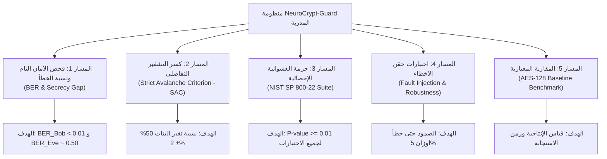

# وثيقة خطة الاختبار والتقييم الأمني الشامل
## مشروع: NeuroCrypt-Guard (Adversarial Neural Cryptography)
### دليل الفحص الجنائي والتشفيري المعياري (Security Benchmarking & Test Protocols)

---

## 1. مقدمة ونطاق التقييم
تحدد هذه الوثيقة بروتوكولات الفحص الأمني الصارم التي يخضع لها نظام **NeuroCrypt-Guard**. وتهدف إلى نقل المنظومة من مجرد تجربة ذكاء اصطناعي إلى نظام أمني مدقق يخضع لنفس المعايير الصارمة المعتمدة في تقييم خوارزميات التشفير الكلاسيكية مثل معايير المعهد الوطني الأمريكي للمعايير والتقنية (NIST SP 800-22) ومقاييس التحليل التفاضلي (Strict Avalanche Criterion - SAC) وهجمات حقن الأخطاء (Fault Injection).

---

## 2. مصفوفة بروتوكولات الفحص الأمني (Security Evaluation Matrix)

---

## 3. تفاصيل البروتوكولات الاختبارية

### 3.1 البروتوكول الأول: فحص الأمان التام والفجوة الأمنية (Secrecy Gap Protocol)
* **المفهوم:** قياس الفرق الحسابي بين دقة فك تشفير الطرف الشرعي بوب وعجز المتنصت إيف.
* **منهجية الفحص:**
  1. توليد $10,000$ زوج من الرسائل والمفاتيح العشوائية المستقلة التي لم ترها الشبكة أثناء التدريب.
  2. قياس معدل خطأ البتات لبوب:
     $$BER_{Bob} = \frac{1}{N} \sum_{i=1}^N \mathbb{I}(\text{sign}(P_i) \ne \text{sign}(P'_i))$$
  3. قياس معدل خطأ البتات لإيف:
     $$BER_{Eve} = \frac{1}{N} \sum_{i=1}^N \mathbb{I}(\text{sign}(P_i) \ne \text{sign}(P''_i))$$
  4. حساب الفجوة الأمنية:
     $$\text{Secrecy Gap} = BER_{Eve} - BER_{Bob}$$
* **معيار النجاح:** يجب أن يكون $BER_{Bob} < 0.01$ (دقة $\ge 99\%$) و $BER_{Eve} \ge 0.42$، محققاً فجوة أمنية تتجاوز **$40\%$**.

---

### 3.2 البروتوكول الثاني: كسر التشفير التفاضلي ومعيار تأثير الانهيار الصارم (SAC Protocol)
* **المفهوم:** التحقق من مبدأ الانتشار (Diffusion) الذي وضعه وبستر وتافاريس (Webster & Tavares, 1985).
* **منهجية الفحص:**
  1. توليد رسالة أصلية $P$ ومفتاح $K$.
  2. تشفير الرسالة للحصول على $C_1 = \text{Alice}(P, K)$.
  3. قلب بت واحد فقط في الرسالة للحصول على $P^\oplus$، ثم تشفيرها للحصول على $C_2 = \text{Alice}(P^\oplus, K)$.
  4. حساب الفارق التفاضلي ($\Delta C = C_1 \oplus C_2$) وتكرار التجربة لـ $10,000$ مرة لكل بت من البتات الـ $N$.
  5. توليد مصفوفة الاعتماد التفاضلية (SAC Dependence Matrix) بحجم $(N \times N)$.
* **معيار النجاح:** يجب أن يكون متوسط كل خلية في المصفوفة ضمن المدى **$48\% \le P(\Delta C_j = 1) \le 52\%$**.

---

### 3.3 البروتوكول الثالث: حزمة اختبارات العشوائية الإحصائية (NIST SP 800-22 Protocol)
* **المفهوم:** فحص ما إذا كان النص المشفر يبدو كضوضاء بيضاء عشوائية خالية من أي دورية إحصائية.
* **منهجية الفحص:**
  1. تجميع تيار نصوص مشفرة مستمر بحجم لا يقل عن **$1,000,000$ بت**.
  2. تمرير التيار الثنائي عبر الفحوصات الإحصائية الـ 15 المعتمدة في وثيقة NIST SP 800-22 Rev. 1a (Rukhin et al., 2010):
     * Frequency (Monobit) Test.
     * Frequency Test within a Block.
     * Runs Test & Longest Run of Ones.
     * Binary Matrix Rank Test.
     * Discrete Fourier Transform (Spectral) Test.
     * Non-overlapping Template Matching Test.
     * Approximate Entropy Test.
     * Cumulative Sums (Forward & Reverse) Test.
* **معيار النجاح:** الحصول على قيمة $P\text{-value} \ge 0.01$ لكل فحص، مما يؤكد خلو النص المشفر من أي تحيز إحصائي.

---

### 3.4 البروتوكول الرابع: اختبارات حقن الأخطاء وإجهاد الأوزان (Fault Injection Protocol)
* **المفهوم:** محاكاة التلاعب العتادي أو تلف الذاكرة (DRAM Bit-Flips / Rowhammer) في أجهزة الحافة الطرفية (Boneh et al., 1997; Rakin et al., 2019).
* **منهجية الفحص:**
  1. **حقن الضوضاء الغاوسية (Gaussian Noise Injection):** إضافة تشويش عشوائي لأوزان طبقات شبكة بوب $W' = W + \mathcal{N}(0, \sigma^2)$ مع زيادة الانحراف المعياري تدريجياً $\sigma \in [0.005, 0.05]$.
  2. **تصفير الأوزان الانتقائي (Weight Pruning / Zeroing):** تصفير نسب متدرجة من أوزان شبكتي أليس وبوب ($1\%, 3\%, 5\%, 10\%$).
  3. قياس مدى تدهور دقة بوب وإمكانية تسريب بيانات غير مشفرة لإيف.
* **معيار النجاح:** صمود النظام واحتفاظ بوب بقدرة فك تشفير مقبولة ($BER < 0.05$) حتى تشويش $\sigma = 0.02$ وتصفير حتى $3\%$ من الأوزان.

---

### 3.5 البروتوكول الخامس: المقارنة المعيارية مع معيار التشفير المتقدم (AES-128 Benchmark)
* **المفهوم:** مقارنة أداء منظومة NeuroCrypt-Guard مع تطبيق AES-128 القياسي عبر معايير الأداء التالية:
  1. **الإنتاجية (Throughput):** حجم البيانات المشفرة في الثانية (MB/s).
  2. **زمن الاستجابة (Latency):** الزمن المستغرق لتشفير وفك تشفير كتلة واحدة بالميكروثانية ($\mu s$).
  3. **كفاءة طمس التكرار (Redundancy Obfuscation):** مقارنة توزيع إنتروبيا النص المشفر عند إدخال نصوص لغوية متكررة من داتا سيت هولمز وإنرون.
