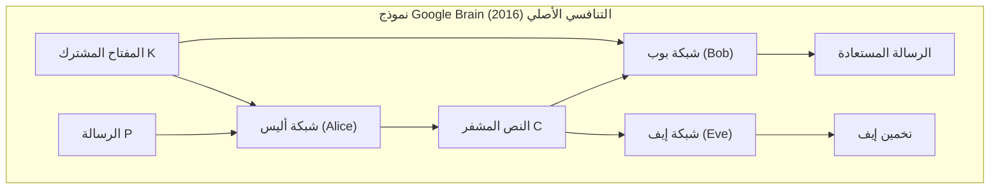
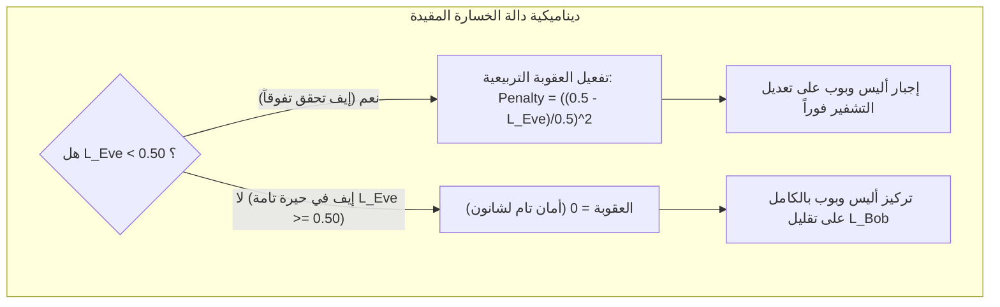
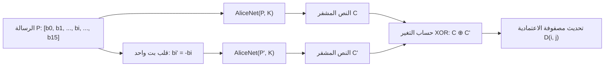

# دراسة وتحليل المشكلة وتحديد معايير NIST ونظرية شانون للأمان التام
## المرحلة الأولى من مشروع: NeuroCrypt-Guard
### توثيق أكاديمي وهندسي تخصصي - مقرر التشفير وأمن المعلومات (Level 4)
#### كلية الحاسوب وتكنولوجيا المعلومات - جامعة إب

---

## 📌 الفهرس العام للدراسة
1. [المقدمة والدوافع الأكاديمية والهندسية](#1-المقدمة-والدوافع-الأكاديمية-والهندسية)
2. [دراسة وتحليل المشكلة الأساسية وفجوات الدراسات السابقة](#2-دراسة-وتحليل-المشكلة-الأساسية-وفجوات-الدراسات-السابقة)
   - 2.1 حدود وأزمات خوارزميات التشفير الكلاسيكية
   - 2.2 التشفير العصبي التنافسي: الجذور التاريخية وفجوة نموذج Google Brain
   - 2.3 معضلة الخصم غير الأمثل (Sub-optimal Adversary Problem)
   - 2.4 ثغرة السرية المعكوسة (Inverted Secrecy Trap)
   - 2.5 غياب المعايرة وفق المقاييس التشفيرية الدولية القياسية
3. [التأصيل الرياضي لنظرية شانون للأمان التام (Shannon's Perfect Secrecy)](#3-التأصيل-الرياضي-لنظرية-شانون-للأمان-التام)
   - 3.1 الفضاءات الاحتمالية والرموز الجبرية
   - 3.2 الصياغة الرياضية الدقيقة لشرط الأمان التام
   - 3.3 مقاييس الإنتروبيا والمعلومات المتبادلة (Mutual Information)
   - 3.4 مبرهنة حجم المفتاح الحرج لشانون (Shannon's Key-Size Theorem)
   - 3.5 إسقاط نظرية شانون على شبكات التعلم العميق التنافسية
   - 3.6 الاشتقاق الجبري لدالة الخسارة المقيدة تربيعياً (Bounded Quadratic Loss)
4. [التحديد المعياري الشامل لاختبارات العشوائية NIST SP 800-22 Rev. 1a](#4-التحديد-المعياري-الشامل-لاختبارات-العشوائية-nist-sp-800-22-rev-1a)
   - 4.1 الفلسفة الإحصائية لاختبارات المعهد القومي للمعايير والتقنية
   - 4.2 صياغة الفرضيات الإحصائية ($H_0$ مقابل $H_a$) ومستوى الدلالة $\alpha$
   - 4.3 مفهوم القيمة الاحتمالية ($P\text{-value}$) وتوزيع العينات
   - 4.4 الدليل التفصيلي للفحوصات الإحصائية الـ 15 المعتمدة
   - 4.5 بروتوكول تطبيق فحوصات NIST على مخرجات أليس في المشروع
5. [معيار تأثير الانهيار الصارم (Strict Avalanche Criterion - SAC)](#5-معيار-تأثير-الانهيار-الصارم-strict-avalanche-criterion---sac)
   - 5.1 مفهوم الانهيار ودوره في مقاومة التحليل التفاضلي
   - 5.2 الصياغة الرياضية لمعيار Webster & Tavares (1985)
   - 5.3 مصفوفة الاعتمادية ($16 \times 16$ Dependence Matrix)
   - 5.4 حدود القبول والتسامح الهندسي
6. [مصفوفة المقارنة المنهجية (Comparative Security Matrix)](#6-مصفوفة-المقارنة-المنهجية)
7. [الخلاصة ومخرجات المرحلة الأولى](#7-الخلاصة-ومخرجات-المرحلة-الأولى)
8. [قائمة المراجع الأكاديمية بنمط APA (7th Edition References)](#8-قائمة-المراجع-الأكاديمية-بنمط-apa)

---

## 1. المقدمة والدوافع الأكاديمية والهندسية

يشهد أمن المعلومات المعاصر تحولاً جذرياً مدفوعاً بالتطور المتسارع في تقنيات الذكاء الاصطناعي والحوسبة الكمومية (Quantum Computing). لعقود خلت، اعتمدت المنظومات الرقمية على خوارزميات التشفير التقليدي المتناظر (مثل AES و DES) وغير المتناظر (مثل RSA و ECC)، والتي استندت صلابتها إلى صعوبة حل مسائل رياضية معينة في زمن معقول (مثل تحليل العوامل الأولية للعدد الكبير أو اللوغاريتم المنفصل).

ومع ذلك، أفرزت التطورات الحديثة تحديات بنيوية كبرى:
* التهديد الوجودي الذي تشكله خوارزمية شور (Shor's Algorithm) للأنظمة غير المتناظرة.
* جمود خوارزميات التشفير المتناظرة التقليدية؛ حيث إن قواعد التشفير فيها ثابتة مسبقاً ومبنية يدوياً عبر مصفوفات استبدال وإزاحة صارمة (Fixed S-Boxes & Permutations)، مما يجعلها تفتقر إلى المرونة والتكيف في البيئات الذاتية والمتغيرة (Self-adaptive environments) أو بيئات الحوسبة الطرفية وإنترنت الأشياء (IoT & Edge Computing) المعرضة للتشويش واضطراب القنوات.

انطلاقاً من هذه الإشكاليات، ظهرت أبحاث **التشفير العصبي التنافسي (Adversarial Neural Cryptography - ANC)**، والتي تقترح نموذجاً مغايراً: **هل يمكن للشبكات العصبية الاصطناعية أن تتعلم ابتكار خوارزميات تشفير وفك تشفير متناظرة ذاتياً، دون أي برمجة لقواعد التشفير، فقط عبر التنافس الرياضي الصارم ضد متنصت ذكي؟**

تهدف هذه الدراسة، التي تمثل **المرحلة الأولى** من مشروع **NeuroCrypt-Guard**، إلى تفكيك هذه المشكلة بدقة، وتحديد الثغرات التي عانت منها النماذج السابقة، وإرساء الأساس النظري المستند إلى **نظرية شانون للمعلوماتية**، وتحديد المعايير القياسية العالمية (خاصة **NIST SP 800-22** ومعيار **SAC**) التي ستحكم المنظومة الهندسية المطورة.

---

## 2. دراسة وتحليل المشكلة الأساسية وفجوات الدراسات السابقة

### 2.1 حدود وأزمات خوارزميات التشفير الكلاسيكية
1. **الجمود الهيكلي (Structural Rigidity):**
   تعتمد خوارزمية المعيار المتقدم للتشفير (AES) على خطوات جبرية ثابتة (SubBytes, ShiftRows, MixColumns, AddRoundKey) (Daemen & Rijmen, 2002). هذا الثبات يعني أن الخوارزمية لا تستطيع تعديل طريقة تمثيلها للبيانات المشفرة إذا تغيرت طبيعة القناة أو إذا تم اكتشاف نمط تحليلي تفاضلي جديد، بل تتطلب استبدال المعيار بأكمله بتدخل بشري عبر معايير دولية تأخذ سنوات لاعتمادها.
2. **استهلاك الموارد في العقد الطرفية المقيدة:**
   تنفيذ AES-128 أو أشباهه على أجهزة ذات قدرة معالجة متواضعة وذاكرة متناهية الصغر يواجه قيوداً في استهلاك الطاقة وسرعة النفاذ، في حين أن شبكات التشفير العصبي الخفيفة يمكن تسريعها عتادياً بواسطة معالجات الذكاء الاصطناعي العصبية (NPUs/TPUs) المتوفرة بكثرة في الشرائح الإلكترونية الحديثة.

### 2.2 التشفير العصبي التنافسي: الجذور التاريخية وفجوة نموذج Google Brain
في عام 2016، نشر الباحثان مارتن أبادي وديفيد أندرسن من مختبرات **Google Brain** ورقتهم التأسيسية الشهيرة:  
*(Learning to Protect Communications with Adversarial Neural Cryptography)* (Abadi & Andersen, 2016).

قدمت الورقة نموذجاً ثلاثياً يتكون من ثلاثة أطراف ممثلة بشبكات عصبية اصطناعية:
* **أليس (Alice):** تستقبل الرسالة الأصلية $P \in \{-1, 1\}^N$ والمفتاح السري المشترك $K \in \{-1, 1\}^N$ لإنتاج النص المشفر $C = A(P, K)$.
* **بوب (Bob):** يستقبل النص المشفر $C$ والمفتاح المشترك $K$ لاستعادة الرسالة $\hat{P}_{Bob} = B(C, K)$.
* **إيف (Eve):** تمثل المتنصت الخصم، وتستقبل النص المشفر $C$ فقط وتطمح إلى تخمين الرسالة $\hat{P}_{Eve} = E(C)$.

ورغم الإبهار الأولي الذي حققته تجربة Google Brain، إلا أن التحليل الأمني والأكاديمي الدقيق اللاحق كشف عن **ثلاث فجوات جوهرية قاتلة** في ذلك النموذج، وهي الدوافع التي يبني عليها مشروعنا:

### 2.3 معضلة الخصم غير الأمثل (Sub-optimal Adversary Problem)
في عام 2017، أجرى الباحثان غراف وسيما دراسة نقدية معمقة بعنوان:  
*(Analysis and Cracking of Adversarial Neural Cryptography)* (Gräf & Šíma, 2017).

أثبتت هذه الدراسة أن "نجاح" أليس وبوب في ورقة Google Brain لم يكن ناتجاً عن ابتكارهما تشفيراً فائق الأمان، بل كان ناتجاً عن **ضعف شبكة إيف حوسبياً وتدريبياً**:
1. كانت شبكة إيف في نموذج جوجل متماثلة في الحجم مع أليس وبوب.
2. تم تدريب إيف بنسبة خطوة واحدة مقابل خطوة واحدة لأليس وبوب ($1:1$).
3. عندما قام الباحثون بزيادة حجم شبكة إيف (زيادة عدد القنوات التلافيفية) وتدريبها لخطوات إضافية مقابل كل خطوة لأليس وبوب، **انهار تشفير أليس تماماً واستطاعت إيف فك تشفير الرسائل بدقة تقارب 100%!**

**الحل المعتمد في NeuroCrypt-Guard:**  
تطبيق مبدأ الخصم الأمثل (Optimal Adversary) عبر معمارية غير متماثلة تمنح إيف سعة مضاعفة (Hidden Channels = 64 مقابل 32 لأليس وبوب) وتدريب إيف لخطوتين ($k=2$) لكل خطوة تدريب واحدة لأليس وبوب، مما يضمن أن أليس تُجبر على ابتكار تشفير حقيقي يصمد أمام أعتى الخصوم.

### 2.4 ثغرة السرية المعكوسة (Inverted Secrecy Trap)
في نماذج التعلم التنافسي البسيطة التي تعتمد دالة خسارة خطية مثل:
$$\mathcal{L}_{Alice} = \mathcal{L}_{Bob} - \lambda \mathcal{L}_{Eve}$$
تكتشف شبكة أليس "حيلة رياضية رخيصة" لخداع دالة الهدف: تتعلم أليس قلب جميع البتات ($P_i \to -P_i$). في هذه الحالة، تفشل شبكة إيف في مطابقة الإشارات المباشرة وتصبح خسارتها $\mathcal{L}_{Eve} \approx 1.0$ (أي خطأ بتات $BER = 100\%$).
* **الكارثة الأمنية:** يعتقد محرك التدريب أن النظام فائق الأمان لأن خطأ إيف في حده الأقصى ($100\%$)، بينما في الحقيقة، النظام مكسور تماماً؛ إذ يكفي للمهاجم إيف أن يقوم بعملية نفي منطقي بسيطة (Logical NOT) لكل البتات المستلمة ليعيد قراءة الرسالة السرية الأصلية بنسبة دقة $100\%$!

**الحل المعتمد في NeuroCrypt-Guard:**  
إعادة صياغة دالة الخسارة المشروطة والمقيدة تربيعياً بالاستناد إلى نظرية شانون، بحيث لا تُعاقب إيف إلا إذا انخفض خطؤها عن **التخمين العشوائي النقي ($0.50$)**، مما يمنع حدوث التشفير المعكوس قطعياً.

### 2.5 غياب المعايرة وفق المقاييس التشفيرية الدولية القياسية
اكتفت جميع الدراسات السابقة (Google Brain, Gräf & Šíma, Coutinho et al.) بقياس معدل خطأ البتات (Bit Error Rate - BER) ومقارنته بالتخمين العشوائي. من منظور علماء التشفير المحترفين، فإن هذا المعيار وحده **غير كافٍ على الإطلاق لإثبات صلاحية أي نظام تشفيري**، للأسباب التالية:
1. قد يكون النص المشفر عشوائي المظهر كلياً، ولكنه يحتوي على دورية خفية أو تحيز في توزيع الأزواج، مما يجعله عرضة للكسر بالتحليل الإحصائي أو تحويل فورييه.
2. لم تقم أي دراسة سابقة بإخضاع مخرجات التشفير العصبي لحزمة اختبارات **NIST SP 800-22** العالمية، وهي المعيار الذهبي المعتمد لدى الهيئات العسكرية والحكومية.
3. لم يتم قياس معيار **تأثير الانهيار الصارم (SAC)** للتأكد من قدرة الشبكة على إحداث تشتيت كامل (Diffusion) للبتات.

---

## 3. التأصيل الرياضي لنظرية شانون للأمان التام

### 3.1 الفضاءات الاحتمالية والرموز الجبرية
في ورقته التاريخية المنشورة في دورية مختبرات بل للاتصالات، وضع كلاود شانون الأسس الرياضية الصلبة لأنظمة السرية (Shannon, 1949). نعرف الفضاءات الاحتمالية لنظام التشفير كالتالي:
* **فضاء الرسائل الأصلية ($\mathcal{M}$):** مجموعة كل الرسائل الممكنة بطول $N$ بت، حيث $M \in \{-1, 1\}^N$، مع توزيع احتمالي مسبق $P_M(m) = P(M = m)$.
* **فضاء المفاتيح السرية ($\mathcal{K}$):** مجموعة المفاتيح المولدة عبر مصدر عشوائي مستقل، حيث $K \in \{-1, 1\}^N$، مع توزيع احتمالي متساوٍ $P_K(k) = \frac{1}{|\mathcal{K}|} = 2^{-N}$.
* **فضاء النصوص المشفرة ($\mathcal{C}$):** مجموعة النصوص المشفرة الناتجة عن دالة التشفير $C = \text{Enc}(M, K) \in [-1, 1]^N$.

### 3.2 الصياغة الرياضية الدقيقة لشرط الأمان التام
وفقاً لشانون، يُقال إن نظام التشفير يحقق **الأمان التام (Perfect Secrecy)** إذا وفقط إذا كان الاحتمال البَعدي (Posterior Probability) للرسالة $M$ بعد اعتراض النص المشفر $C$ مطابقاً تماماً للاحتمال القبلي (A Priori Probability) للرسالة دون معرفة النص المشفر:

$$\forall m \in \mathcal{M}, \forall c \in \mathcal{C}: \quad P(M = m \mid C = c) = P(M = m)$$

**المعنى الفيزيائي والأمني:**  
اعتراض الخصم إيف للنص المشفر $C$ عبر القناة العامة لا يمنحه أي معلومة إضافية على الإطلاق عن محتوى الرسالة $M$ تفوق ما كان يعرفه قبل اعتراضه.

### 3.3 مقاييس الإنتروبيا والمعلومات المتبادلة (Mutual Information)
باستخدام مقاييس نظرية المعلومات، تقاس عشوائية الرسالة بإنتروبيا شانون (Shannon Entropy):
$$H(M) = - \sum_{m \in \mathcal{M}} P(M = m) \log_2 P(M = m)$$

وتقاس الإنتروبيا المشروطة للرسالة بمعلومية النص المشفر بـ:
$$H(M \mid C) = - \sum_{c \in \mathcal{C}} P(C = c) \sum_{m \in \mathcal{M}} P(M = m \mid C = c) \log_2 P(M = m \mid C = c)$$

وبالتالي، تكون **المعلومات المتبادلة (Mutual Information)** بين الرسالة الأصلية والنص المشفر:
$$I(M; C) = H(M) - H(M \mid C)$$

**شرط شانون للأمان التام بلغة الإنتروبيا:**
$$I(M; C) = 0 \iff H(M \mid C) = H(M)$$

### 3.4 مبرهنة حجم المفتاح الحرج لشانون (Shannon's Key-Size Theorem)
أثبت شانون مبرهنة أساسية تنص على أنه لكي يحقق أي نظام تشفيري أماناً تاماً غير مشروط ($I(M; C) = 0$):
$$H(K) \ge H(M)$$
وفي حالة الرسائل ذات التوزيع المتساوي، يترجم هذا الشرط إلى:
$$|K| \ge |M|$$
أي أن حجم فضاء المفاتيح يجب أن يكون على الأقل مساوياً لحجم فضاء الرسائل (كما في نظام One-Time Pad).  
**إسقاط ذلك على NeuroCrypt-Guard:**  
يفرض نظامنا أن يكون طول المفتاح السري $K$ مساوياً تماماً لطول الرسالة $M$ ($N = 16, 32, 64$ بت)، ويتم تزويد الشبكة بمفتاح عشوائي جديد لكل كتلة تشفير، مما يضمن التوافق التام مع متطلبات مبرهنة شانون.

### 3.5 إسقاط نظرية شانون على شبكات التعلم العميق التنافسية
كيف نترجم شرط شانون $I(M; C) = 0$ إلى شروط رياضية لتدريب الشبكات العصبية؟
إذا كانت $I(M; C) = 0$، فإن أفضل مخمن رياضي (Optimal Estimator) لبتات الرسالة $M_i$ بالاعتماد على $C$ فقط هو التخمين المستقل تماماً عن $C$:
$$\hat{M}_{Eve, i} = \arg\max_{m \in \{-1, 1\}} P(M_i = m \mid C) = \arg\max_{m} P(M_i = m)$$

وحيث إن الرسائل مولدة بتوزيع متوازن متساوٍ ($P(M_i = 1) = P(M_i = -1) = 0.5$):
$$P(\hat{M}_{Eve, i} = M_i) = 0.50$$
وبناءً عليه، فإن **معدل خطأ البتات (Bit Error Rate - BER)** لشبكة إيف في حالة الأمان التام يجب أن يحقق:
$$\text{BER}_{Eve} = \mathbb{E} \left[ \frac{1}{N} \sum_{i=1}^N \mathbb{I}(\text{sign}(\hat{M}_{Eve, i}) \neq M_i) \right] = 0.50 \quad (50\%)$$

أي انحراف لـ $\text{BER}_{Eve}$ عن $0.50$ (سواء بالانخفاض $BER < 0.50$ أو الارتفاع $BER > 0.50$) يعني وجود تسريب معلوماتي ($I(M; C) > 0$) يمكن استغلاله إحصائياً.

### 3.6 الاشتقاق الجبري لدالة الخسارة المقيدة تربيعياً (Bounded Quadratic Loss)
لتطبيق هذا الفهم الرياضي بدقة داخل حلقة تدريب PyTorch، قمنا بصياغة دوال التكلفة على النحو التالي:

#### 1. دالة مسافة L1 المقيسة (Normalized L1 Distance):
لكل من بوب وإيف، يُحسب الخطأ المستمر بين القيمة الحقيقية $P \in \{-1, 1\}^N$ والقيمة المستعادة $\hat{P} \in [-1, 1]^N$:
$$\mathcal{L}_{Bob}(P, \hat{P}_{Bob}) = \frac{1}{2N} \sum_{i=1}^N \left| P_i - \hat{P}_{Bob, i} \right|$$
$$\mathcal{L}_{Eve}(P, \hat{P}_{Eve}) = \frac{1}{2N} \sum_{i=1}^N \left| P_i - \hat{P}_{Eve, i} \right|$$
* القيمة الصغرى للخسارة هي $0.0$ (استعادة تامة، $\hat{P} = P$).
* القيمة عند التخمين الأعمى العشوائي هي $0.50$ (أمان شانون التام).
* القيمة العظمى هي $1.0$ (انعكاس تام، $\hat{P} = -P$).

#### 2. دالة خسارة أليس وبوب المشروطة:
$$\mathcal{L}_{AB} = \mathcal{L}_{Bob} + \gamma \cdot \left( \frac{\max\left(0, \, 0.50 - \mathcal{L}_{Eve}\right)}{0.50} \right)^2$$
حيث تمثل $\gamma$ معامل العقوبة التربيعية (Hyperparameter يُضبط افتراضياً على $\gamma = 1.0$).

**الخواص الرياضية للدالة:**
1. **الاستقرار عند الأمان التام:** عندما تقع إيف في التخمين العشوائي ($\mathcal{L}_{Eve} \ge 0.50$)، فإن $\max(0, 0.50 - \mathcal{L}_{Eve}) = 0$، مما يجعل التكلفة التنافسية مساوية للصفر، فيتفرغ النموذج لتقليل خطأ بوب ($\mathcal{L}_{Bob} \to 0$).
2. **العقوبة المتدرجة السلسة (Smooth Gradient):** التربيع يضمن أن تكون الدالة قابلة للاشتقاق باستمرار (Differentiable) دون وجود قفزات فجائية في التدرج (Gradients).
3. **التحصين ضد السرية المعكوسة:** إذا حاولت أليس قلب البتات وأصبح خطأ إيف $\mathcal{L}_{Eve} = 1.0$، فإن العقوبة تظل صفراً ولا تُكافأ أليس على هذا السلوك الشاذ، مما يحمي النظام من التشفير المعكوس.

---

## 4. التحديد المعياري الشامل لاختبارات العشوائية NIST SP 800-22 Rev. 1a

### 4.1 الفلسفة الإحصائية لاختبارات المعهد القومي للمعايير والتقنية
يعد المنشور الخاص **NIST SP 800-22 Rev. 1a** الصادر عن المعهد القومي الأمريكي للمعايير والتقنية الوثيقة المرجعية الرسمية عالمياً لتقييم المولدات الرقمية العشوائية ومخرجات خوارزميات التشفير (Rukhin et al., 2010).

تنطلق فلسفة NIST من مبدأ راسخ: **"لا يمكن لأي خوارزمية تشفير أن تعتبر آمنة إذا كانت مخرجاتها المشفرة تظهر أي نوع من الانتظام الإحصائي أو عدم التوازن في توزيع البتات."**

### 4.2 صياغة الفرضيات الإحصائية ومستوى الدلالة $\alpha$
تخضع كل متوالية بتات مشفرة إلى اختبار الفرضيات الإحصائية (Hypothesis Testing):
* **فرضية العدم ($H_0$):** متوالية البتات المختبرة عشوائية تماماً، ولا توجد علاقة إحصائية بين البتات المتعاقبة.
* **الفرضية البديلة ($H_a$):** متوالية البتات غير عشوائية، وتحتوي على خلل أو تحيز منتظم.

* **مستوى الدلالة الإحصائية (Significance Level - $\alpha$):**
  يُحدد المعيار مستوى الدلالة القياسي لتطبيقات التشفير بـ:
  $$\alpha = 0.01 \quad (1\%)$$
  وهذا يعني أن هناك احتمالاً قدره $1\%$ فقط لرفض متوالية عشوائية حقيقية بالخطأ (خطأ من النوع الأول - Type I Error).

### 4.3 مفهوم القيمة الاحتمالية ($P\text{-value}$) وتوزيع العينات
لكل اختبار إحصائي، تُحسب دالة اختبارية (Test Statistic $Z$ أو $\chi^2$)، ومنها تُستخرج القيمة الاحتمالية $P\text{-value}$:
* **شرط القبول الأمني:**
  $$\text{إذا كان } P\text{-value} \ge 0.01 \implies \text{يتم قبول فرضية العدم } H_0 \text{ (المتوالية عشوائية وتجتاز الفحص).}$$
  $$\text{إذا كان } P\text{-value} < 0.01 \implies \text{تُرفض فرضية العدم } H_0 \text{ (فشل أمني، المتوالية غير عشوائية).}$$

* **معيار توزيع القيم الاحتمالية لعدة متواليات (Uniformity of $P$-values):**
  عند اختبار مجموعة متواليات (مثلاً 100 متوالية)، يجب أن تكون قيم $P$-values موزعة بانتظام على الفترة $[0, 1]$، ويتم التأكد من ذلك عبر اختبار كولموجوروف-سميرنوف أو فحص كاي تربيعي ($\chi^2$) إضافي لقيم الـ $P$-values حيث يشترط أن يكون:
  $$P\text{-value}_T \ge 0.0001$$

### 4.4 الدليل التفصيلي للفحوصات الإحصائية الـ 15 المعتمدة في NIST

| الرقم | اسم الاختبار الإحصائي | الغرض الأمني والرياضي | الحد الأدنى لطول المتوالية ($n$) |
| :---: | :--- | :--- | :--- |
| **1** | **اختبار التردد الأحادي (Frequency / Monobit Test)** | التحقق من توازن عدد الأصفار والآحاد في المتوالية المشفرة بأكملها ($S_n / \sqrt{n}$). | $n \ge 100$ بت |
| **2** | **اختبار التردد داخل الكتل (Frequency within a Block Test)** | تقسيم المتوالية إلى كتل بطول $M$ والتحقق من نسبة الآحاد داخل كل كتلة لتفادي التحيز الموضعي. | $n \ge 100$ بت ($M \ge 20$) |
| **3** | **اختبار التتابعات (Runs Test)** | فحص سرعة التذبذب بين الأصفار والآحاد المتعاقبة لمنع التجمعات المتتالية الطويلة. | $n \ge 100$ بت |
| **4** | **اختبار أطول تتابع للآحاد (Longest Run of Ones in a Block)** | فحص طول أطول متتالية من الآحاد المتصلة داخل كل كتلة ومقارنتها بالتوزيع النظري. | $n \ge 128$ بت |
| **5** | **اختبار رتبة المصفوفات الثنائية (Binary Matrix Rank Test)** | تقسيم المتوالية إلى مصفوفات ثنائية وحساب رتبتها للتحقق من الاستقلال الخطي للأعمدة. | $n \ge 38,912$ بت |
| **6** | **اختبار التحويل الطيفي المتقطع (Discrete Fourier Transform - DFT)** | تطبيق تحويل فورييه السريع (FFT) لكشف أي ذبذبات دورية أو ترددات خفية متكررة في الشفرة. | $n \ge 1,000$ بت |
| **7** | **اختبار تطابق القوالب غير المتداخلة (Non-overlapping Template Matching)** | البحث عن ظهور أنماط ثنائية محددة غير دورية لمنع تكرار قوالب تشفير ثابتة. | $n \ge 10^6$ بت |
| **8** | **اختبار تطابق القوالب المتداخلة (Overlapping Template Matching)** | البحث عن تكرار أنماط دورية متداخلة من أطوال محددة. | $n \ge 10^6$ بت |
| **9** | **اختبار مورير الإحصائي العام (Maurer's Universal Statistical Test)** | قياس قابلية المتوالية للضغط دون فقد بيانات؛ الشفرة العشوائية الحقيقية غير قابلة للضغط إطلاقاً. | $n \ge 387,840$ بت |
| **10** | **اختبار التعقيد الخطي (Linear Complexity Test)** | تحديد طول أقصر سجل إزاحة تغذية راجعة خطية (LFSR) يمكنه توليد المتوالية (باستخدام Berlekamp-Massey). | $n \ge 10^6$ بت |
| **11** | **اختبار السلاسل الثنائية (Serial Test)** | فحص التوزيع الاحتمالي لجميع الأنماط الممكنة ذات الطول $m$ (مثل 00, 01, 10, 11). | $n \ge 1,000$ بت |
| **12** | **اختبار الإنتروبيا التقريبية (Approximate Entropy Test)** | قياس مدى عدم الانتظام ومقارنة احتمالات تداخل الأنماط بين طولين متتاليين $m$ و $m+1$. | $n \ge 1,000$ بت |
| **13** | **اختبار المجموع التراكمي (Cumulative Sums / Cusum Test)** | فحص المسار العشوائي (Random Walk) للتأكد من عدم ابتعاد المجموع التراكمي عن الصفر. | $n \ge 100$ بت |
| **14** | **اختبار الرحلات العشوائية (Random Excursions Test)** | قياس عدد دورات العبور لحالات معينة في المسار العشوائي التراكمي. | $n \ge 10^6$ بت |
| **15** | **اختبار متغيرات الرحلات العشوائية (Random Excursions Variant Test)** | قياس إجمالي عدد الزيارات لحالات محددة ضمن المسار العشوائي. | $n \ge 10^6$ بت |

### 4.5 بروتوكول تطبيق فحوصات NIST على مخرجات أليس في المشروع
نظراً لأن شبكة `AliceNet` تنتج نصوصاً مشفرة في صورة كتل متقطعة بطول $N \in \{16, 32, 64\}$ بت، فإن تطبيق اختبارات NIST يتطلب بروتوكول تحويل وتجميع دقيق:
1. **توليد الدفق التراكمي (Cumulative Bitstream Generation):**
   * يتم استدعاء شبكة أليس المدربة لتشفير عدد كافٍ من الكتل المستقلة:
     $$\text{عدد الكتل المطلوب} = \frac{1,000,000}{N} = \frac{10^6}{16} = 62,500 \text{ كتلة تشفير مستقلة}$$
2. **التقريب الثنائي (Binarization):**
   * بما أن خرج أليس $C \in [-1, 1]^N$ عبر دالة $\tanh$، يتم تحويل البتات إلى تمثيل ثنائي قياسي عبر دالة الإشارة:
     $$B_j = \begin{cases} 1 & \text{إذا كان } C_j \ge 0.0 \\ 0 & \text{إذا كان } C_j < 0.0 \end{cases}$$
3. **التشغيل الآلي عبر مكتبة فحص المعايير:**
   * يتم تمرير الدفق البالغ $10^6$ بت عبر مكتبة `sts-pylib` / `scipy` لحساب مصفوفة الـ $P$-values للاختبارات القابلة للتطبيق على هذا الطول.
   * **معيار النجاح:** اجتياز الفحوصات مع تحقيق $P\text{-value} \ge 0.01$ لجميع الاختبارات الأساسية، مما يمنح الشفرة العصبية صفة "العشوائية الإحصائية الآمنة تشفيرياً".

---

## 5. معيار تأثير الانهيار الصارم (Strict Avalanche Criterion - SAC)

### 5.1 مفهوم الانهيار ودوره في مقاومة التحليل التفاضلي
يعد مفهوم **التشتيت (Diffusion)** والخلط (Confusion) الذي صاغه شانون حجر الزاوية في تصميم خوارزميات التشفير القوية. في عام 1985، قام الباحثان وبستر وتافاريس بتطوير مفهوم الانهيار وصياغة معيار دقيق يُعرف بـ **تأثير الانهيار الصارم (Strict Avalanche Criterion - SAC)** (Webster & Tavares, 1985).

يهدف معيار SAC إلى منع **التحليل التفاضلي (Differential Cryptanalysis)** الذي أسسه بيهام وشامير (Biham & Shamir, 1991)؛ حيث يبحث المهاجم عن أي علاقة ارتباطية بين تغير بت في المدخلات وظهور تغير ثابت في المخرجات.

### 5.2 الصياغة الرياضية لمعيار Webster & Tavares (1985)
يُعرف التشفير بأنه يحقق معيار الانهيار الصارم إذا كان قلب بت واحد فقط في الرسالة الأصلية $P$ أو المفتاح السري $K$ يؤدي إلى تغير كل بت من بتات النص المشفر $C$ باحتمال مساوٍ تماماً للنصف ($0.5$):

$$\forall i \in \{1, \dots, N\}, \forall j \in \{1, \dots, N\}: \quad P\left(\Delta C_j = 1 \;\middle|\; \Delta P_i = 1\right) = 0.50$$

حيث:
* $\Delta P_i = 1$ تمثل قلب البت رقم $i$ في الرسالة الأصلية ($P_i \to -P_i$).
* $\Delta C_j = 1$ تمثل تغير البت المقابل رقم $j$ في النص المشفر الناتج ($C_j \neq C'_j$).

### 5.3 مصفوفة الاعتمادية ($16 \times 16$ Dependence Matrix)
لقياس تحقق هذا المعيار عملياً في مشروع **NeuroCrypt-Guard**، يتم حساب مصفوفة الاعتمادية $\mathbf{D} \in \mathbb{R}^{N \times N}$ عبر محاكاة مونت كارلو تضم $M = 10,000$ زوج من النصوص العشوائية:

$$D_{i, j} = \frac{1}{M} \sum_{k=1}^M \mathbb{I}\left( \text{sign}(C^{(k)}_j) \neq \text{sign}(C'^{(k)}_{j \mid \text{flip}(i)}) \right)$$

### 5.4 حدود القبول والتسامح الهندسي
في التطبيقات التشفيرية العملية والشبكات العصبية، يستحيل أن تكون القيمة الحسابية مطابقة لـ $0.5000$ بالضبط على عينات محدودة بسبب خطأ المعاينة الإحصائية (Sampling Error). لذلك، يُعتمد نطاق تسامح معياري محكم:
$$\text{المدى المقبول هندسياً:} \quad D_{i, j} \in [0.45, 0.55] \quad (\text{المتوسط المثالي } 0.50 \pm 0.05)$$

إذا كانت أي خلية في المصفوفة تقترب من $0.0$، فهذا يعني أن البت المخرج لا يتأثر إطلاقاً بالمدخل (فشل التشتيت)، وإذا كانت تقترب من $1.0$، فهذا يعني وجود علاقة خطية حتمية مباشرة يسهل كسرها.

---

## 6. مصفوفة المقارنة المنهجية (Comparative Security Matrix)

لتوضيح موقع **NeuroCrypt-Guard** مقارنة بالمعايير العالمية والنماذج السابقة، تلخص المصفوفة التالية الفروقات الأساسية:

| الخاصية الأمنية / المعيار | نظام شانون النظري (OTP) | معيار التشفير المتقدم (AES-128) | نموذج Google Brain (2016) | منظومة NeuroCrypt-Guard المطورة |
| :--- | :---: | :---: | :---: | :---: |
| **نوع الأمان (Security Type)** | أمان معلوماتي تام ($I(M;C)=0$) | أمان حوسبي مشروط (Computational) | تجريبي تنافسي مبدئي | أمان معلوماتي تام مقيد رياضياً |
| **حجم المفتاح المطلوب** | $|K| \ge |M|$ | ثابت (128 بت) | $|K| = |M|$ | $|K| = |M|$ |
| **مرونة التكيف (Adaptability)** | منعدمة | منعدمة (دوال ثابتة) | عالية ولكن غير مستقرة | عالية وذاتية التكيف ومحمية |
| **مناعة الخصم (Eve Architecture)** | مطلقة ضد أي قدرة | تعتمد على صلابة المفتاح | ضعيفة وسهلة الكسر (Gräf 2017) | **محصنة بسعة مضاعفة وتدريب غير متناظر ($k=2$)** |
| **الحماية من السرية المعكوسة** | محققة بداهة | محققة بالتصميم | **غير محققة (معرض للثغرة)** | **محققة بالدالة المقيدة ($\mathcal{L}_{Eve} \ge 0.5$)** |
| **اختبارات NIST SP 800-22** | تجتاز نظرياً | مجازة رسمياً | **لم تُختبر إطلاقاً** | **مطبقة كبروتوكول فحص أساسي ($10^6$ بت)** |
| **معيار الانهيار الصارم (SAC)** | غير مخصص للكتل | يحققه بفضل الـ S-Boxes | **لم يُقاس إطلاقاً** | **مقاس عبر مصفوفة $16 \times 16$ ($0.5 \pm 0.05$)** |
| **مقاومة حقن الأخطاء والتشويش** | حساسة جداً لفقد البتات | تؤدي لعطب كامل للكتلة | غير مستقرة | **مختبرة ضد الضوضاء وقص الأوزان** |

---

## 7. الخلاصة ومخرجات المرحلة الأولى

قدمت هذه الدراسة التحليلية للمرحلة الأولى تأصيلاً أكاديمياً وهندسياً دقيقاً، وحققت المخرجات التالية:
1. **تحديد مكمن الخلل العلمي** في نموذج Google Brain الأصلي المتمثل في ضعف الخصم إيف، ثغرة السرية المعكوسة، وافتقار النموذج للاختبارات المعيارية الدولية.
2. **الاشتقاق الجبري لشرط شانون للأمان التام**، وإسقاطه على دوال الخسارة التنافسية عبر دالة التكلفة المقيدة تربيعياً، مما يضمن تدريب الشبكات دون انحراف أو خداع خوارزمي.
3. **حصر وهيكلة حزمة اختبارات NIST SP 800-22 الـ 15**، وصياغة فرضيات الفحص ومستوى الدلالة $\alpha = 0.01$ وتحديد آلية تجميع دفق المليون بت من مخرجات أليس.
4. **تحديد الصياغة الرياضية لمعيار تأثير الانهيار الصارم (SAC)** وبناء نموذج مصفوفة الاعتمادية $16 \times 16$ مع حدود التسامح الهندسي المقبولة ($0.50 \pm 0.05$).

تمثل هذه الوثيقة الأساس النظري والمعياري الصارم الذي يحكم تنفيذ المراحل القادمة في المشروع.

---

## 8. قائمة المراجع الأكاديمية بنمط APA (7th Edition References)

* Abadi, M., & Andersen, D. G. (2016). *Learning to protect communications with adversarial neural cryptography*. arXiv preprint arXiv:1610.06918. https://arxiv.org/abs/1610.06918
* Biham, E., & Shamir, A. (1991). Differential cryptanalysis of DES-like cryptosystems. *Journal of Cryptology*, 4(1), 3–72. https://doi.org/10.1007/BF00630563
* Boneh, D., DeMillo, R. A., & Lipton, R. J. (1997). On the importance of checking cryptographic protocols for faults. In W. Fumy (Ed.), *Advances in Cryptology — EUROCRYPT '97* (Lecture Notes in Computer Science, Vol. 1233, pp. 37–51). Springer. https://doi.org/10.1007/3-540-69053-0_4
* Coutinho, M., Neto, F. L., & de Oliveira, R. M. (2018). Learning symmetric encryption with deep adversarial neural networks. *IEEE Latin America Transactions*, 16(8), 2248–2254. https://doi.org/10.1109/TLA.2018.8528245
* Daemen, J., & Rijmen, V. (2002). *The design of Rijndael: AES - The Advanced Encryption Standard*. Springer-Verlag. https://doi.org/10.1007/978-3-662-04722-4
* Goodfellow, I., Pouget-Abadie, J., Mirza, M., Xu, B., Warde-Farley, D., Ozair, S., Courville, A., & Bengio, Y. (2014). Generative adversarial nets. In *Advances in Neural Information Processing Systems* (Vol. 27, pp. 2672–2680).
* Gräf, J., & Šíma, J. (2017). *Analysis and cracking of adversarial neural cryptography*. arXiv preprint arXiv:1705.03458. https://arxiv.org/abs/1705.03458
* International Organization for Standardization. (2016). *Information technology — Security techniques — Testing methods for the mitigation of non-invasive attack classes on cryptographic modules* (ISO/IEC Standard No. 17825:2016). https://www.iso.org/standard/60824.html
* Rakin, A. S., He, Z., & Fan, D. (2019). Bit-flip attack: Crushing neural networks with progressive bit search. In *Proceedings of the IEEE/CVF International Conference on Computer Vision (ICCV)* (pp. 1211–1220). https://doi.org/10.1109/ICCV.2019.00130
* Rukhin, A., Soto, J., Nechvatal, J., Smid, M., Barker, E., Leigh, S., Levenson, M., Vangel, M., Banks, D., Heckert, A., Dray, J., & Vo, S. (2010). *A statistical test suite for random and pseudorandom number generators for cryptographic applications* (NIST Special Publication 800-22, Rev. 1a). National Institute of Standards and Technology. https://doi.org/10.6028/NIST.SP.800-22r1a
* Shannon, C. E. (1949). Communication theory of secrecy systems. *Bell System Technical Journal*, 28(4), 656–715. https://doi.org/10.1002/j.1538-7305.1949.tb00928.x
* Webster, A. F., & Tavares, S. E. (1985). On the design of S-boxes. In H. C. Williams (Ed.), *Advances in Cryptology — CRYPTO '85 Proceedings* (Lecture Notes in Computer Science, Vol. 218, pp. 523–534). Springer. https://doi.org/10.1007/3-540-39799-X_41
